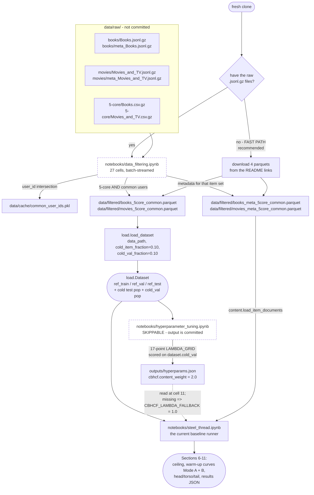

# How do I get from zero to a running evaluation?

Three notebooks, run in order, and two of the three are skippable. The **fast path** skips
`data_filtering.ipynb` entirely by downloading its output parquets; step 4 is skippable
because its output (`outputs/hyperparams.json`) is committed. So the shortest route from a
fresh clone to numbers is: download four parquet files, run `steel_thread.ipynb`.

The one thing you cannot skip is the GPU. `steel_thread.ipynb` and
`hyperparameter_tuning.ipynb` both default to `DEVICE = "cuda:1"`, and the Mode A/Mode B
sweeps call into [gpu_retrieval.py](../recsys/gpu_retrieval.py), which requires `torch`
with CUDA. `torch` is imported lazily ([gpu_retrieval.py:52](../recsys/gpu_retrieval.py:52)
and elsewhere), so a CPU-only machine can import the package and build a `Dataset` — it
just cannot run a sweep.

## What each step actually does

| Node | Source | Purpose |
|---|---|---|
| `data_filtering.ipynb` | [notebooks/data_filtering.ipynb](../notebooks/data_filtering.ipynb) | Streams the raw `.jsonl.gz` reviews and metadata through PyArrow in batches (`BATCH_SIZE = 100_000`, `META_BATCH_SIZE = 50_000`), keeps only users present in **both** Books and Movies, then intersects with the 5-core sets. |
| `common_user_ids.pkl` | cell 11, `CACHE_DIR = Path("../data/cache")` | The Books ∩ Movies `user_id` intersection. Cached because recomputing it is expensive; shared via the README link. |
| `books_5core_common.parquet` | cell 23, `FILTERED = Path("../data/filtered")` | The interaction table `load_dataset` reads. Columns used downstream: `user_id`, `parent_asin`, `rating`, `timestamp`. |
| `books_meta_5core_common.parquet` | cell 26 | Item metadata for that item set. Feeds `content.load_item_documents` and `load.load_titles`. |
| `load.load_dataset` | [load.py:150](../recsys/load.py:150) | The only external data dependency in the package. Reads the parquet, remaps raw ids to contiguous indices, selects the cold populations, builds the leave-last-out warm split. Prints a full diagnostic summary. |
| `load.Dataset` | [load.py:35](../recsys/load.py:35) | What every model and every eval function consumes. See the field table below. |
| `hyperparameter_tuning.ipynb` | [notebooks/hyperparameter_tuning.ipynb](../notebooks/hyperparameter_tuning.ipynb) | Selects CBHCF's lambda on `dataset.cold_val` — never on the reported test population. `LAMBDA_GRID` has 17 points, `K_LEVELS_TUNE = [0, 2, 5, 10, 20]`, `N_SEEDS_TUNE = 2`. |
| `outputs/hyperparams.json` | cell 9, `json.dump(record, f, indent=2)` | Committed. Records the selected `content_weight`, the full objective-by-lambda trace, the ALS params, and a `dataset_fingerprint` so it cannot be silently reused against a different split. |
| `steel_thread.ipynb` | [notebooks/steel_thread.ipynb](../notebooks/steel_thread.ipynb) | 30 cells, Sections 0–12. Fits Popularity, ALS (`N_SEEDS = 10`), and CBHCF, then runs both warm-up sweeps and the ceilings. |

## The `Dataset` you get back

Everything downstream reads these fields and nothing else — no raw ids, no source parquet.

| Field | Type | Meaning |
|---|---|---|
| `ref_train` | `csr_matrix (n_users x n_items)` | Warm-item training data. Every model's `fit()` input. |
| `ref_val` | `csr_matrix` | Warm-item validation — the (N-1)th interaction per user under leave-last-out. |
| `ref_test` | `csr_matrix` | Warm-item held-out — the Nth. The "normal system" reference. |
| `test_matrix` | `csr_matrix` | The cold items' permanently reserved test set: last `test_size = 5` interactions per cold item. Fixed across every `k`. |
| `reveal_pool` | `dict[item_idx -> user_index array]` | First `n_reveal = 20` interactions per cold item — the revealable pool the warm-up curve walks. |
| `ceiling_pool` | `dict[item_idx -> user_index array]` | *All* pre-test interactions per cold item. Folding one in with all of this is its own fully-warm state. |
| `cold_item_ids` | `np.ndarray` | Sorted cold item indices. 2,727 items in the run recorded in `hyperparams.json`. |
| `cold_val` | `Dataset` or `None` | A **second, disjoint** cold population for hyperparameter selection. Shares `ref_train`/`ref_val`/`ref_test` and the id maps by reference; carries its own cold items. `None` on the nested instance, so there is no recursion. |

Derived views, all built on demand: `revealed_matrix_at_k` ([load.py:59](../recsys/load.py:59)),
`revealed_item_users_at_k` ([load.py:69](../recsys/load.py:69)),
`ceiling_matrix` ([load.py:81](../recsys/load.py:81)),
`ceiling_item_users` ([load.py:93](../recsys/load.py:93)).

## Split parameters that matter

Both notebooks pass `SPLIT_PARAMS = dict(cold_item_fraction=0.10, cold_val_fraction=0.10)`
and take the rest of [load_dataset](../recsys/load.py:150)'s defaults:

- `min_interactions = 25` — **cold-item eligibility**. Only items with at least this many
  post-filter interactions can be selected as cold, which guarantees each one can supply
  the full `k = 0..20` sweep plus a 5-interaction reserved test.
- `cold_item_fraction=0.10` / `cold_val_fraction=0.10` are fractions **of that eligible
  pool**, not of the whole catalog. The remaining 80% of eligible items stay warm.
- `min_rating = 4.0` — only 4- and 5-star reviews count as positive. Amazon ratings are
  explicit, so unlike the MovieLens convention a 1–3 star review is not a positive signal.
- `n_reveal = 20`, `test_size = 5` — the reveal pool is the *first* 20 interactions
  chronologically; the reserved test is the *last* 5. Eligibility guarantees they never
  overlap ([load.py:212](../recsys/load.py:212) raises if you break that).
- `seed = 42` — the two cold populations are drawn **sequentially from one generator**, so
  adding a validation population does not perturb the test population.

Setting `cold_val_fraction=0` recovers single-population behaviour, but it changes
`ref_train` (the validation items rejoin it), so **any cached Dataset, fitted model, or
result from a different `cold_val_fraction` is stale.** That is what
`dataset_fingerprint` ([load.py:107](../recsys/load.py:107)) exists to catch.

## Gotchas

- **Notebook working directory.** Notebooks run from `notebooks/` and pass `../data/...`.
  The defaults baked into [load.py:151](../recsys/load.py:151) and
  [load.py:366](../recsys/load.py:366) are repo-root-relative and will not resolve from a
  notebook. Always pass the path.
- **Import `recsys` before `numpy` if you can.** [`recsys/__init__.py`](../recsys/__init__.py)
  pins the BLAS thread pool to 1 by two mechanisms: env vars (only effective pre-numpy) and
  `threadpoolctl.threadpool_limits` (effective after). `implicit` warns that a
  multi-threaded BLAS pool causes severe performance problems for CPU ALS.
- **`steel_thread.ipynb` has W&B logging off by default** (`WANDB_ENABLED = False`, cell 2).
  Leave it off unless you mean to upload.
- **`RUN_CBHCF` and `RUN_POP` are switches** (cells 11 and 14). Setting `RUN_CBHCF = False`
  reproduces the pure-baseline run.
