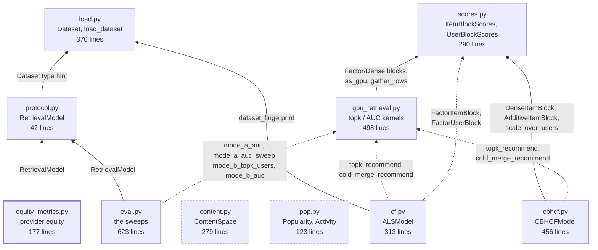

# What breaks if I edit this file?

Ten modules, and the import graph is deliberately shallow: **`load.py` is the only module
with more than one importer, and nothing imports `eval.py`.** Most coupling runs through
two contracts rather than through imports — `protocol.RetrievalModel` (what a model must
be) and `scores.ItemBlockScores` / `scores.UserBlockScores` (what a score source must be).

The graph has two kinds of edge, and the difference matters when you are tracing a change:

- **Solid** = module-level `import` at the top of the file. A cycle here would be a real
  circular-import error.
- **Dashed** = function-local import, deferred to call time. `cf`, `cbhcf`, and `eval` all
  reach `gpu_retrieval` this way, which is how `cf.py` and `gpu_retrieval.py` can depend on
  each other without a cycle — and how a CPU-only environment can import the package
  without `torch` installed.

## Reading the graph

| Module | file | Nothing in `recsys/` imports it? | Who actually uses it |
|---|---|---|---|
| [load.py](../recsys/load.py) | 370 lines | — | `protocol` (type hint), `cf` (fingerprint), and every notebook. **The most load-bearing file in the package.** |
| [protocol.py](../recsys/protocol.py) | 42 lines | — | `eval`, `equity_metrics`. Pure contract; no runtime behavior. |
| [scores.py](../recsys/scores.py) | 290 lines | — | `gpu_retrieval` (top-level), `cbhcf` (top-level), `cf` (deferred). |
| [gpu_retrieval.py](../recsys/gpu_retrieval.py) | 498 lines | — | `cf`, `cbhcf`, `eval` — all deferred. |
| [cf.py](../recsys/cf.py) | 313 lines | **yes** | Notebooks, and `cbhcf` holds an instance (never imports the module). |
| [cbhcf.py](../recsys/cbhcf.py) | 456 lines | **yes** | Notebooks only. |
| [content.py](../recsys/content.py) | 279 lines | **yes** | Notebooks only. `cbhcf` consumes its *output matrix*, not the module. |
| [pop.py](../recsys/pop.py) | 123 lines | **yes** | Notebooks only. `eval` handles Popularity/Activity duck-typed, never by import. |
| [eval.py](../recsys/eval.py) | 623 lines | **yes** | Notebooks only. It is the top of the stack. |
| [equity_metrics.py](../recsys/equity_metrics.py) | 177 lines | **yes — and by nothing else either** | Nothing. No module, no notebook. See [06](06-provider-equity.md). |

Four modules are import-leaves (`cf`, `cbhcf`, `content`, `pop`, plus `eval`) — that is by
design: the notebooks are the wiring layer. `equity_metrics.py` is different in kind: it is
a leaf that **nothing calls at all**, including notebooks. That is intentional and tracked
as future work, not an oversight.

## The couplings that imports do not show

An import graph under-reports this package. Three things bind modules together without an
edge above, and they are where changes actually propagate.

**1. `protocol.RetrievalModel` is structural, not nominal.** It is a
`@runtime_checkable` `Protocol` ([protocol.py:13](../recsys/protocol.py:13)), so
`isinstance()` checks method *existence only* — not signatures, not behavior.
`eval._check_model` ([eval.py:23](../recsys/eval.py:23)) and
`equity_metrics._check_model` ([equity_metrics.py:120](../recsys/equity_metrics.py:120))
both rely on it. Consequence: a class can pass the check and still fail at runtime. See
[03](03-adding-a-model.md) for the two live cases.

**2. Private attributes are a de-facto second interface.** `eval.py` reaches into
`model._auc_candidate_ids`, `model._auc_global_to_local`, `model._auc_warm_global_to_local`,
`model._cold_global_to_local`, and `model._device`
([eval.py:126](../recsys/eval.py:126), [eval.py:167](../recsys/eval.py:167),
[eval.py:181](../recsys/eval.py:181), [eval.py:226](../recsys/eval.py:226),
[eval.py:319](../recsys/eval.py:319)). `CBHCFModel` has to mirror all of them —
`_POOL_ATTRS` ([cbhcf.py:121](../recsys/cbhcf.py:121)) exists solely to copy that set off
the wrapped `ALSModel`. **Rename a `_pool` attribute in `cf.py` and you must update
`cbhcf._POOL_ATTRS` and `eval.py` together.**

**3. Duck-typed branches.** `eval.py` detects the Activity floor with
`hasattr(models[0], "user_activity")` ([eval.py:543](../recsys/eval.py:543)), and
`ceiling_reference` / `evaluate_at_k` decide whether to compute AUC with
`getattr(model, "_auc_candidate_ids", None) is not None`. Adding an attribute with one of
those names to an unrelated model silently changes which branch runs.

## Change-impact cheat sheet

| If you edit… | Re-check |
|---|---|
| `load.Dataset` fields | `dataset_fingerprint` ([load.py:107](../recsys/load.py:107)) — it enumerates fields explicitly; every `eval.py` sweep; `cf.py`'s fold cache key. |
| `load.load_dataset` split params | Every committed artifact keyed on the fingerprint, including `outputs/hyperparams.json`. |
| `protocol.RetrievalModel` | `pop.py`, `cf.py`, `cbhcf.py` (all three must still satisfy it), plus both `_check_model` error messages. |
| any `_auc_*` / `_cold_*` / `_warm_*` attribute in `cf.py` | `cbhcf._POOL_ATTRS`, and the five `eval.py` sites above. |
| a `scores.*Block` signature | `gpu_retrieval` (every kernel takes `source=`), `cf`'s four `*_source()` methods, `cbhcf`'s five. |
| `gpu_retrieval` kernel signatures | `cf.recommend`/`recommend_cached`/`build_warm_cache`, the CBHCF equivalents, and six call sites in `eval.py`. |
| `content.ContentSpace.transform` | **The row-L2-normalization is load-bearing.** `cbhcf` relies on `T @ T.T` being exactly cosine similarity ([cbhcf.py:31](../recsys/cbhcf.py:31)); breaking it silently corrupts every content score rather than raising. |
