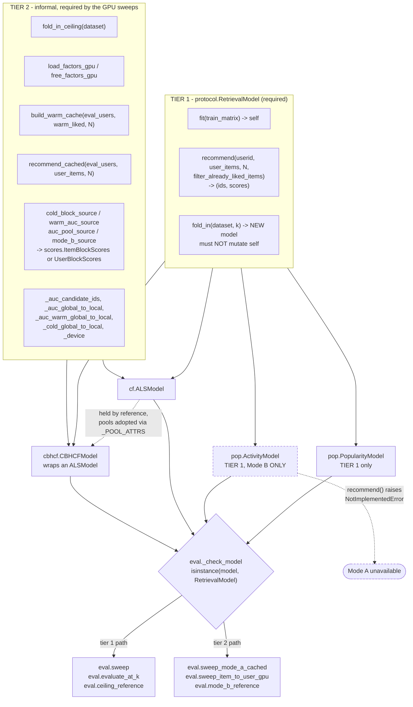

<!-- This file was created with the assistance of Generative AI -->

# How do I add a new model?

Satisfy three methods — `fit`, `recommend`, `fold_in` — and `eval.py` will sweep your model
without a single model-specific branch. That is the whole contract
([protocol.py:14](../recsys/protocol.py:14)). What the diagram below adds is the part the
Protocol does *not* say: there is a **second, informal tier** of methods that the fast GPU
sweeps require, and two of the four existing implementors do not implement all of it.

Decide up front which tier you need. Tier 1 gets you `eval.sweep` and
`eval.ceiling_reference`. Tier 2 gets you `eval.sweep_mode_a_cached` and
`eval.sweep_item_to_user_gpu` — the ones the notebook actually runs at full scale.

## The contract, method by method

| Node | Source | What it must do |
|---|---|---|
| `RetrievalModel` | [protocol.py:14](../recsys/protocol.py:14) | `@runtime_checkable` structural Protocol. Existence-checked only — see the warnings below. |
| `fit` | [protocol.py:26](../recsys/protocol.py:26) | Fit on a `user x item` CSR training matrix, return `self`. Takes **only** `train_matrix` in the base signature; extra parameters must be keyword-only. |
| `recommend` | [protocol.py:30](../recsys/protocol.py:30) | `implicit`'s calling convention exactly: `userid` may be scalar or array; returns `(ids, scores)` shaped `(N,)` or `(len(userid), N)`. |
| `fold_in` | [protocol.py:37](../recsys/protocol.py:37) | Return a **new** object at reveal level `k`, without mutating `self`. Strategy is implementation-defined; callers must not assume which. |
| `PopularityModel` | [pop.py:11](../recsys/pop.py:11) | Ranks items by raw training-interaction count. `fold_in` ([pop.py:76](../recsys/pop.py:76)) is a **full refit** on `ref_train + revealed_matrix_at_k(k)`. |
| `ActivityModel` | [pop.py:89](../recsys/pop.py:89) | Mode B dual: ranks *users* by volume. `fold_in` ([pop.py:115](../recsys/pop.py:115)) is a no-op — activity is frozen. |
| `ALSModel` | [cf.py:26](../recsys/cf.py:26) | Wraps `implicit.als.AlternatingLeastSquares`. `fold_in` ([cf.py:297](../recsys/cf.py:297)) is a **cheap exact partial update** via `recalculate_item`. |
| `CBHCFModel` | [cbhcf.py:72](../recsys/cbhcf.py:72) | Wraps an already-fit `ALSModel` and adds a content term. `fold_in` ([cbhcf.py:411](../recsys/cbhcf.py:411)) delegates to the wrapped model — only the CF cold factors move. |
| `_check_model` | [eval.py:23](../recsys/eval.py:23) | Fails fast on e.g. a raw `AlternatingLeastSquares` passed instead of `cf.ALSModel`. |

### Why `fold_in` returns a new object

Because the sweeps fold the *same base model* at every level. `eval.sweep_mode_a_cached`
([eval.py:306](../recsys/eval.py:306)) calls `model.fold_in(dataset, k)` inside the k-loop
and keeps using `model` — if `fold_in` mutated in place, level `k=2` would fold on top of
`k=1`. `ALSModel._fold_in_with` ([cf.py:281](../recsys/cf.py:281)) does this with
`copy.copy` plus a fresh `item_factors` array; `CBHCFModel._folded`
([cbhcf.py:398](../recsys/cbhcf.py:398)) does the same one level up.

### The two Tier-2 things you will forget

**Score sources, not factors.** `gpu_retrieval`'s kernels take an optional `source=`
argument — a `scores.ItemBlockScores` or `scores.UserBlockScores`. If your score is not
`user_factors @ item_factors.T`, this is your entry point; you do not need factors at all.
`eval.py` calls `folded.cold_block_source()`, `model.warm_auc_source()`,
`folded.auc_pool_source()`, and `folded.mode_b_source()` directly
([eval.py:133](../recsys/eval.py:133), [eval.py:308](../recsys/eval.py:308),
[eval.py:320](../recsys/eval.py:320), [eval.py:560](../recsys/eval.py:560)). See
[04](04-cbhcf-score-composition.md) for how CBHCF uses this.

**Candidate pools.** `eval.evaluate_at_k` ([eval.py:226](../recsys/eval.py:226)) and
`ceiling_reference` ([eval.py:126](../recsys/eval.py:126)) both gate AUC on
`getattr(model, "_auc_candidate_ids", None) is not None`. No pools means **AUC comes back
`NaN`, silently** — which is correct for Popularity (its AUC is filled separately by
`pop_auc_curve`) but is a trap for a new model. `ALSModel.prepare_gpu_recommend`
([cf.py:130](../recsys/cf.py:130)) is what populates them.

## Two live cases where `isinstance` passes but the model does not work

The Protocol is `runtime_checkable`, which checks **method existence only** — not
signatures, not behavior. Both existing exceptions are deliberate and documented, but you
should know them before you assume the check protects you.

**`ActivityModel.recommend` raises `NotImplementedError`**
([pop.py:109](../recsys/pop.py:109)). It passes `_check_model` and then explodes on any
Mode A path. `eval.sweep_item_to_user_gpu` avoids this by branching on
`hasattr(models[0], "user_activity")` ([eval.py:543](../recsys/eval.py:543)) — a duck-typed
check, not a Protocol one. If you add a Mode-B-only model, you must add a similar branch or
route around Mode A yourself.

**`CBHCFModel.fit` requires a keyword-only `item_content`**
([cbhcf.py:110](../recsys/cbhcf.py:110)), so `fit(train_matrix)` alone raises `TypeError`.
This is explicitly blessed by the "shared-embeddings convention" in
[protocol.py:17-23](../recsys/protocol.py:17) — extra parameters are allowed as long as
they are keyword-only, and `eval.py`'s sweeps never call `fit()` themselves. Fitting is
notebook-level orchestration.

## Minimal checklist for a new model

1. Implement `fit`, `recommend`, `fold_in`. Extra `fit` parameters must be keyword-only.
2. `fold_in` returns a new object. Verify with `id()` that `self` is unchanged.
3. Add `fold_in_ceiling(dataset)` — `eval.ceiling_reference`
   ([eval.py:121](../recsys/eval.py:121)) calls it unconditionally, so without it Tier 1 is
   incomplete too.
4. If you want AUC: populate `_auc_candidate_ids`, `_auc_global_to_local`,
   `_auc_warm_global_to_local`, `_cold_global_to_local`, `_device`, and expose
   `auc_pool_source()` / `warm_auc_source()`.
5. If you want the fast sweeps: add `load_factors_gpu` / `free_factors_gpu`,
   `build_warm_cache`, `recommend_cached`, `cold_block_source`, `mode_b_source`.
6. Wire it in `steel_thread.ipynb` alongside the existing `seed_models` lists — `eval.sweep`
   takes a **list** of independently-fit instances and averages across them
   ([eval.py:240](../recsys/eval.py:240)). One seed is a list of length one.
7. If it wraps another model, copy that model's pool attributes. `CBHCFModel._adopt_pools`
   ([cbhcf.py:126](../recsys/cbhcf.py:126)) is the pattern.
