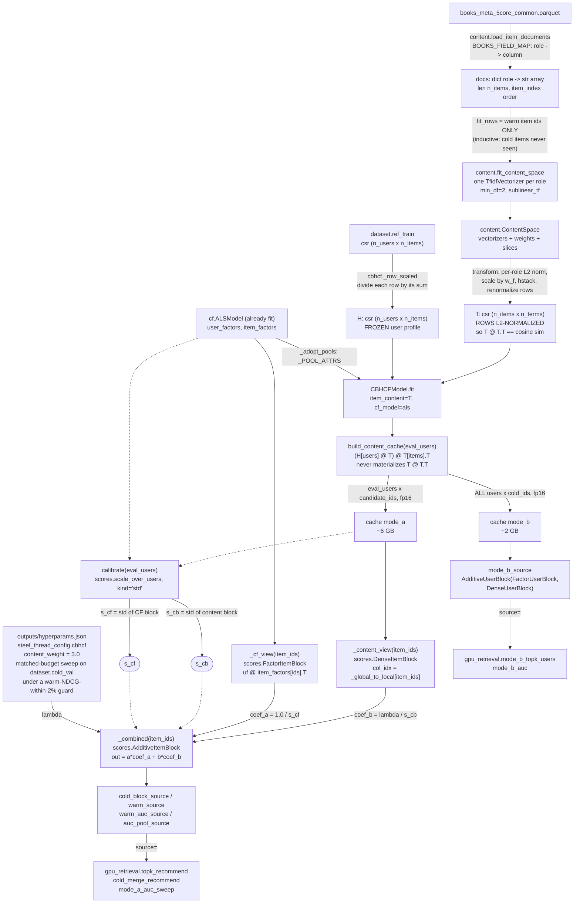

# How does CBHCF combine ALS and content?

One line of arithmetic, applied per candidate block:

```
score(u, i) = cf(u, i) / s_cf  +  lambda * content(u, i) / s_cb
```

Additive, not a convex blend. Scaled multiplicatively, never offset. Both scales measured
once and frozen. Everything below is the machinery that makes those three properties hold
at 487,790 items, and each one is load-bearing for a specific reason — the design notes at
[cbhcf.py:1-51](../recsys/cbhcf.py:1) explain why, and this diagram shows where.

The single most important consequence: **at reveal level 0 an ALS-folded cold item's factor
is the exact zero vector**, so `cf(u, i) = 0` and the item ranks on content alone. The
handoff from content to collaborative then happens on its own as the collaborative term
grows. There is no schedule, no threshold, and no per-item weight — the one free parameter
is `lambda`. Subtracting a minimum during scaling would map that structural zero to a
positive constant and hand every cold item a spurious collaborative bonus, which is why the
scaling is divide-only ([scores.py:214-219](../recsys/scores.py:214)).



## Node reference

| Node | Source | Purpose |
|---|---|---|
| `load_item_documents` | [content.py:269](../recsys/content.py:269) | Reads the metadata parquet, returns `role -> per-item-index string array`. Kept out of `load.py` so the `Dataset` contract stays about interactions only. |
| `BOOKS_FIELD_MAP` | [content.py:87](../recsys/content.py:87) | `role -> [columns]`, first non-empty wins. Books and Movies share a physical schema but not a semantic one, so code refers to **roles**, never column names. |
| `build_documents` | [content.py:142](../recsys/content.py:142) | Row-aligns raw metadata to `item_index` order via `dataset.index_to_item`. Items with no metadata row become empty strings — a zero block. |
| `fit_content_space` | [content.py:215](../recsys/content.py:215) | One TF-IDF block per role, fit on `fit_rows` **only**. `min_df=2` drops singleton terms (a term in one item cannot produce any item-item similarity but still consumes the block's norm). |
| `ContentSpace.transform` | [content.py:189](../recsys/content.py:189) | Per-role L2-normalize, scale by `w_f`, `hstack`, renormalize rows. Yields BM25F-style weighted-average cosine. **The row normalization is the load-bearing invariant.** |
| `DEFAULT_WEIGHTS` | [content.py:81](../recsys/content.py:81) | `title 1.0, creator 1.0, taxonomy 0.5, blurb 1.0, reviews 0.5`. |
| `_row_scaled` | [cbhcf.py:63](../recsys/cbhcf.py:63) | Row-normalizes `ref_train` to a user profile; all-zero rows stay zero (no history → score 0, not NaN). |
| `CBHCFModel.fit` | [cbhcf.py:110](../recsys/cbhcf.py:110) | Stores `T`, the frozen history, and the **already-fit** CF model. CBHCF never refits ALS — that is what makes the ALS-vs-CBHCF gap attributable to the content term alone. |
| `_adopt_pools` / `_POOL_ATTRS` | [cbhcf.py:126](../recsys/cbhcf.py:126), [cbhcf.py:121](../recsys/cbhcf.py:121) | Copies the wrapped model's 12 candidate-pool attributes so both methods rank over identical sets. |
| `build_content_cache` | [cbhcf.py:164](../recsys/cbhcf.py:164) | The expensive step, run once per run and picklable to disk. Two blocks: Mode A (`eval_users x candidate_ids`) and Mode B (`all users x cold_ids`). |
| `content_scores` | [cbhcf.py:150](../recsys/cbhcf.py:150) | `(H[users] @ T) @ T[items].T`. The `_items_T` hoist out of the chunk loop is worth 12.6x. |
| `_block_gpu` | [cbhcf.py:275](../recsys/cbhcf.py:275) | cuSPARSE SpMM path: 35 s vs 10.4 min on CPU, agreeing to 3.9e-07. SpMM (sparse x dense), not SpGEMM — the product is ~99% dense. |
| `calibrate` | [cbhcf.py:298](../recsys/cbhcf.py:298) | Measures `s_cf` and `s_cb` **once** on the base model. Folded models and lambda-variants inherit them. |
| `scale_over_users` | [scores.py:264](../recsys/scores.py:264) | Streaming std (default) over `users x item block`, never materializing the full score matrix. Used as a **divisor only**. |
| `DenseItemBlock` | [scores.py:131](../recsys/scores.py:131) | Indexes the precomputed content block. fp16 storage, reads promoted to fp32. `col_idx` selects a sub-pool as a per-chunk column view, so one 6 GB block serves warm / cold / AUC pools. |
| `FactorItemBlock` | [scores.py:87](../recsys/scores.py:87) | The bilinear source: `uf @ V.T`, item block gathered once. |
| `AdditiveItemBlock` | [scores.py:231](../recsys/scores.py:231) | `out = a.user_scores * coef_a; out += b.user_scores * coef_b`. Mutates in place — legal because `user_scores` must return a caller-mutable tensor. |
| `_combined` | [cbhcf.py:335](../recsys/cbhcf.py:335) | Where lambda actually enters: `coef_a = 1.0 / s_cf`, `coef_b = content_weight / s_cb`. |
| `with_content_weight` | [cbhcf.py:309](../recsys/cbhcf.py:309) | Cheap copy at a different lambda, sharing cache/scales/CF model by reference. This is what the lambda sweep iterates over. |
| `wrap_seeds` | [cbhcf.py:426](../recsys/cbhcf.py:426) | One CBHCF per ALS seed, **all sharing one content cache**. Only `s_cf` is remeasured per seed (factor scales differ by initialization). |

## Where lambda comes from

**Two lambdas live in `hyperparams.json`, and the steel thread runs the second one.** This is the
single easiest thing to get wrong in this repo, so read the key before quoting a number:

| Key | `content_weight` | Written by | Used by |
|---|---|---|---|
| `cbhcf` | **2.5** | `hyperparameter_tuning.ipynb` — lambda alone, at the default field weights | nothing, directly |
| `steel_thread_config.cbhcf` | **3.0** | `intervention_a_weight_sweep.ipynb`, assembled by `recsys.steel_config.build` | `steel_thread.ipynb`, `intervention_b_coldllm.ipynb` |

Every reported CBHCF number comes from **3.0**. `steel_config.load()` reads
`steel_thread_config`; the `cbhcf` block is the standalone lambda tune and is superseded by the
matched-budget sweep, which searches field weights *and* lambda for both arms on one shared grid so
neither enters the steel thread with a tuning advantage. `steel_thread.ipynb` calls
`steel_config.load` at cell 11 and falls back to `CBHCF_LAMBDA_FALLBACK = 1.0` if the file is
missing.

The selection rule behind the `cbhcf` block is still worth understanding, because the same
warm-NDCG guard governs the sweep that supersedes it. 2.5 was not chosen by maximizing the
cold-start objective; it was chosen by maximizing it **subject to not degrading warm performance**:

| Field in `hyperparams.json["cbhcf"]` | Value | Meaning |
|---|---|---|
| `selected_on` | `cold_val (2,727 items)` | `dataset.cold_val` — the disjoint validation cold population, never the reported test set. |
| objective | mean NDCG@100 over `k = [0, 2, 5, 10, 20]` + the within-item ceiling, 2 seeds | `K_LEVELS_TUNE`, `N_SEEDS_TUNE`, `CEILING_WEIGHT = 1.0` in the tuning notebook. |
| `grid` | 11 points | The lambda grid searched. |
| `warm_reference` | 0.05441 | Best warm NDCG@100 on `ref_val` across the grid. |
| `warm_tolerance` / `warm_floor` | 0.02 / 0.05332 | The constraint: warm NDCG must stay within 2% of the best in the grid. |
| `unconstrained_best_lambda` | 8.0 | What the cold objective alone would have picked — content-heavy, but finite. |
| `constraint_was_binding` | `true` | **The warm guard, not the cold objective, selected 2.5.** |
| `dataset_fingerprint` | 10-tuple | Stamped so the artifact cannot be silently reused against a different split. |

## Three scale tricks worth knowing before you edit

**1. The similarity matrix never exists.** `content.py` guarantees `T` has L2-normalized
rows, so `cosine_similarity(T) == T @ T.T` and the score factors as `(H @ T) @ T.T` rather
than `H @ (T @ T.T)`. The latter would be a dense 487,790 x 487,790 matrix — about 950 GB.
The per-user profile `H @ T` is not materialized for the whole population either; it is
projected one chunk at a time.

**2. The user profile is frozen on `ref_train`.** Only the *item's* representation moves as
it accumulates history. Letting a user's content profile absorb revealed cold items would
add a second moving part confounded with the axis being plotted — measured at 15.7% of eval
users shifting by `k=20`. `freeze_user_profile=False`
([cbhcf.py:403](../recsys/cbhcf.py:403)) restores the prototype behaviour for an ablation,
and invalidates the cache.

**3. Freezing makes content scores k-invariant *and* seed-invariant *and*
lambda-invariant.** That is why the cache is computed once and replayed across every
`(seed, k)` pair, and why a lambda sweep re-scores from the same cache with nothing
recomputed.

## Asymmetry to be aware of

`CBHCFModel` exposes `warm_source()` ([cbhcf.py:343](../recsys/cbhcf.py:343)); `ALSModel`
has no such method. ALS builds its warm cache by passing factors straight to
`gpu_retrieval.topk_recommend` ([cf.py:198](../recsys/cf.py:198)), whereas CBHCF must pass
`source=self.warm_source()` ([cbhcf.py:382](../recsys/cbhcf.py:382)) because its score is
not bilinear. Both have `warm_auc_source()`, which `eval.py` calls generically. If you add
a non-bilinear model, follow the CBHCF side.

`prepare_gpu_recommend` also differs deliberately: CBHCF's
([cbhcf.py:130](../recsys/cbhcf.py:130)) **does not inherit ALS's chunk size**. The additive
source materializes two score tensors before summing, so its peak is roughly double at the
same chunk — hence the factor of 3 in its chunk calculation.
