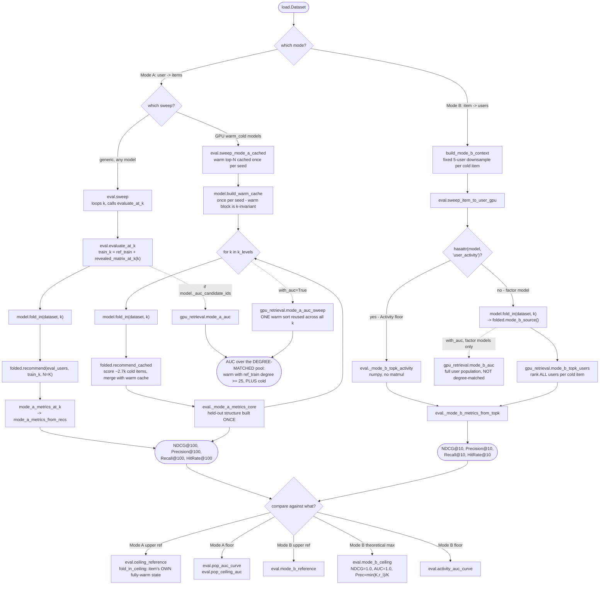

# What does this accuracy number mean?

Before reading a number off a curve, you need three facts about it: **which mode** produced
it, **which candidate pool** it ranked against, and **which reference** it should be
compared to. Get any of those wrong and the number is uninterpretable — an AUC of 0.93 is
excellent against a degree-matched pool and unremarkable against the full catalog.

- **Mode A** ranks *items* for a user. "Did the cold item reach this user's top-K?"
- **Mode B** ranks *users* for a cold item. "Did the item's ranking surface the users who
  actually wanted it?"

They are duals, computed by separate code paths, with separate ceilings and separate floors.
`K` differs too: 100 for Mode A, 10 for Mode B. And `k` — lowercase — is the reveal level,
`0..20`, which is the x-axis of every curve. Both appear in the same signatures.

## Node reference

| Node | Source | Purpose |
|---|---|---|
| `sweep` | [eval.py:240](../recsys/eval.py:240) | Generic Mode A sweep. Works for any `RetrievalModel`; averages across a list of independently-fit seeds at each `k`. Returns `(curve, n_eval_per_k)`. |
| `evaluate_at_k` | [eval.py:214](../recsys/eval.py:214) | One reveal level: build `train_k`, fold, recommend, score. |
| `sweep_mode_a_cached` | [eval.py:261](../recsys/eval.py:261) | The fast path the notebook actually runs. Produces the **identical** NDCG/Precision/Recall/HitRate curve as `sweep` — verified bit-for-bit — at ~L-fold less recommend work, L = number of k-levels. Requires `candidates='warm_cold'`. |
| `mode_a_metrics_at_k` | [eval.py:38](../recsys/eval.py:38) | Macro-averaged NDCG/Precision/Recall/HitRate from a **single** `recommend()` call, restricted to users who actually have a held-out test item. Users with zero test items contribute nothing to a macro average, so skipping them is exact, not an approximation. |
| `_mode_a_metrics_core` | [eval.py:77](../recsys/eval.py:77) | The metric math, factored out so a sweep can build the held-out structure `(rows, items, rel)` once from the fixed test set and reuse it across every `(seed, k)`. |
| `mode_a_auc` | [gpu_retrieval.py:153](../recsys/gpu_retrieval.py:153) | Per-user Mann-Whitney rank-sum AUC over the candidate pool. **Average ranks** via two-sided `searchsorted`, so ties are handled correctly. |
| `mode_a_auc_sweep` | [gpu_retrieval.py:254](../recsys/gpu_retrieval.py:254) | Sweep fast path: the warm score row is frozen within a seed, so it is sorted **once** and reused for every `k`; only the small cold block re-sorts. Chunk-outer / k-inner on purpose, so a chunk's sorted warm scores never exist for all users at once. |
| `ceiling_reference` | [eval.py:107](../recsys/eval.py:107) | The Mode A upper reference. |
| `cold_item_degree_buckets` | [eval.py:343](../recsys/eval.py:343) | Equal-count tail/torso/head buckets by **total** interaction count (ceiling-pool size + the fixed `test_size`). |
| `ceiling_metrics_by_bucket` | [eval.py:367](../recsys/eval.py:367) | Stratified HitRate@K and NDCG@K at the ceiling. Answers "even fully warm, are low-degree items retrieved worse?" |
| `build_mode_b_context` | [eval.py:428](../recsys/eval.py:428) | Draws a fixed random 5-user sample from each cold item's reserved test pool, once, reused across every `k` and seed — so Precision/Recall are not dominated by a few high-`r_i` items. |
| `sweep_item_to_user_gpu` | [eval.py:525](../recsys/eval.py:525) | Mode B sweep. Scores only the cold-item columns, never the dense `n_users x n_items` matrix. |
| `mode_b_topk_users` | [gpu_retrieval.py:379](../recsys/gpu_retrieval.py:379) | Per cold item, rank all users, return the top-N non-revealed. Items as rows so top-K runs along the contiguous axis. |
| `mode_b_auc` | [gpu_retrieval.py:420](../recsys/gpu_retrieval.py:420) | Per-cold-item AUC over the **full** user population. Positives are the full reserved test set, not the downsampled context. |
| `mode_b_ceiling` | [eval.py:449](../recsys/eval.py:449) | Theoretical maximum, not a model result: NDCG and AUC are 1.0 by construction; Precision@K = `min(K, r_i)/K` and Recall@K = `min(K, r_i)/r_i`. |
| `mode_b_reference` | [eval.py:594](../recsys/eval.py:594) | Mode B analog of `ceiling_reference`. Factor models only. |
| `pop_auc_curve` / `pop_ceiling_auc` | [eval.py:172](../recsys/eval.py:172), [eval.py:158](../recsys/eval.py:158) | The Popularity floor's AUC, on the same degree-matched basis as ALS. |
| `activity_auc_curve` | [eval.py:195](../recsys/eval.py:195) | The Mode B floor's AUC, over all users. |
| `_rank1` | [eval.py:152](../recsys/eval.py:152) | `(n, 1)` factors whose dot with an all-ones vector reproduces a value — lets the rank-1 Popularity/Activity models reuse the AUC kernels with no special-casing. |

## The three things that most change a number's meaning

### 1. Which pool the AUC ranked against

**Mode A AUC is degree-matched. Mode B AUC is not.** This asymmetry is deliberate.

Mode A ranks a partially-revealed cold item against warm competitors whose `ref_train`
degree is at least `auc_min_degree = 25` ([cf.py:130](../recsys/cf.py:130)), plus the cold
items. Without that restriction, a Popularity floor scores a misleadingly high AUC simply by
beating the enormous low-degree tail. Degree-matching removes that inflation. **Top-K
metrics do not use the degree-matched pool** — they keep the full `warm_cold` pool
([eval.py:375](../recsys/eval.py:375)). So NDCG@100 and AUC on the same plot rank against
*different* pools, on purpose.

Mode B's ranked set is the whole user population, with no degree matching
([eval.py:598](../recsys/eval.py:598)).

Report Mode A AUC as **"AUC (candidate pool)"**. The pool is the entire deterministic
candidate set retrieved from, not a random negative sample, so the Krichene–Rendle critique
of sampled metrics does not apply ([gpu_retrieval.py:163](../recsys/gpu_retrieval.py:163)).

### 2. Which reference the curve is heading toward

`ceiling_reference` is **not** a different population of warm items. It is the *same* cold
items, folded in with all of their pre-test history (`dataset.ceiling_pool`), evaluated on
the *same* last-5 reserved test. That makes it degree-matched by construction — it is the
curve's own asymptote rather than a cross-population comparison.

For an item with exactly `min_interactions = 25` total interactions, the ceiling equals the
`k=20` curve endpoint. For higher-degree items it uses the extra interactions between
`n_reveal` and `item_total - test_size`, so the reference sits **above** the endpoint. That
gap is the data-abundance headroom, not a modeling failure.

### 3. Whether AUC is `NaN`, and why

`evaluate_at_k` and `ceiling_reference` both gate AUC on
`getattr(model, "_auc_candidate_ids", None) is not None`. Models without candidate pools —
Popularity — return `NaN`, and their AUC is filled separately by `pop_auc_curve` /
`pop_ceiling_auc` so it lands on the same basis as ALS. `_mode_b_metrics_from_topk`
([eval.py:479](../recsys/eval.py:479)) always returns `AUC: NaN`, because Mode B AUC needs
the full-set ranking and comes from `mode_b_auc` instead. The `ActivityModel` floor's Mode B
AUC stays `NaN` throughout — it ranks by global activity, not factors.

A per-user or per-item `NaN` from the AUC kernels themselves means something different:
that user had no in-pool positive, or no negative. Both kernels return `NaN` in that case
and the sweeps aggregate with `np.nanmean`.

### A detail that surprises people

An eval user with no warm history gets an all-zero ALS factor, so **every candidate scores
identically** and the user's positive ties with the entire pool. The correct AUC there is
exactly 0.5, and only average ranks produce it — ordinal `argsort` ranks would return an
arbitrary value in `[0, 1]`. That is why both AUC kernels use two-sided `searchsorted`
rather than a sort position, verified against `scipy.rankdata`.

## Curve shape

Every sweep returns `(curve, n_eval_per_k)` where
`curve[metric] = {"mean": [...], "std": [...]}`, one entry per `k`. `mean` and `std` are
**across seeds** at that `k`, not across users — with `N_SEEDS = 10` in the notebook, `std`
is the ALS initialization spread. Deterministic models (Popularity, Activity) report
`std = 0` exactly.

---

## Drift

Places where prose contradicts the code. Reported, not fixed.

**None outstanding.** The two items this section carried both belonged to
`recsys/equity_metrics.py` and were tracked against its integration rather than against the
evaluation harness: `load_provider_metadata`'s citation of the deleted `data_cleaning.ipynb`
(and the `book_`/`movie_` id convention it described), and `_check_model`'s reference to a
`score_matrix` method the protocol does not declare. Both were **fixed** by the Step 2 rewrite
rather than merely reported — neither string survives in the module. See
[06](06-provider-equity.md#drift), which is likewise empty.

## Open questions

Things not determinable from the source.

1. **Which sweep produced the committed numbers.** `steel_thread.ipynb` calls both
   `ev.sweep` and `ev.sweep_mode_a_cached` (cell 20). The docstrings assert they agree
   bit-for-bit, but the notebook's stored outputs do not make clear which one feeds the
   reported figures, or whether `ev.sweep` is retained only as a parity check.
2. **The `bench_*` parity gates are referenced but absent.** `bench_7`, `bench_8`,
   `bench_8b`, `bench_9`, `bench_14`, `bench_15`, `bench_16` are cited across
   `gpu_retrieval.py`, `eval.py`, and `scores.py` as the correctness checks on the fast
   paths. No such files exist in the repo. Whether they live in a notebook, another branch,
   or were removed is not determinable from source.
3. **`METRICS` and `METRICS_MODE_B` are identical lists**
   ([eval.py:19-20](../recsys/eval.py:19)). Whether the split is anticipating a future
   divergence or is vestigial is not stated.
4. **`auc_min_degree = 25` coincides with `min_interactions = 25`.** Both default to 25, in
   different modules ([cf.py:130](../recsys/cf.py:130),
   [load.py:152](../recsys/load.py:152)), with no comment linking them. Whether that is a
   deliberate coupling or a coincidence is unclear — it matters, because changing one
   without the other silently changes what the degree-matched pool means.
5. **Mode B's `K = 10` versus Mode A's `K = 100`.** Set in the notebook
   (`K_MODE_B = 10`, cell 25) with no recorded rationale. Since Precision@K in Mode B is
   bounded by `min(K, r_i)/K` and `r_i` is fixed at `DOWNSAMPLE_SIZE = 5`, the Precision
   ceiling is 0.5 by construction — presumably intentional, but not stated.
