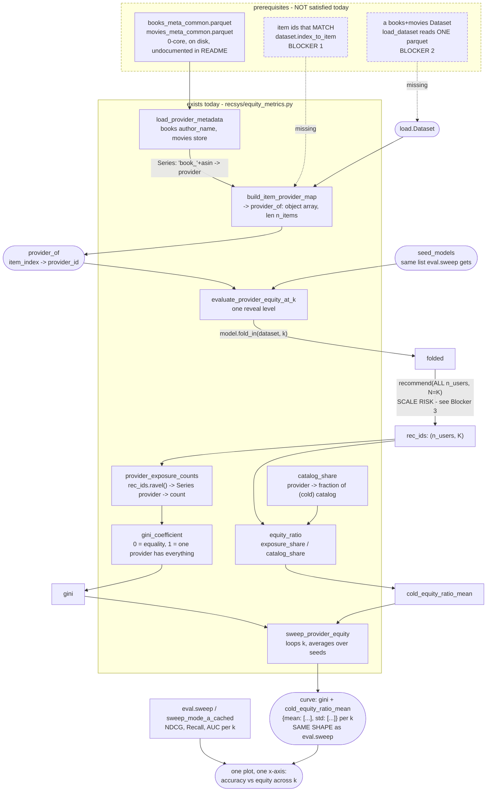

# Who gets exposure, and how do we turn it on?

> **Status: not wired in.** Nothing imports `recsys/equity_metrics.py` — no module, no
> notebook. That is deliberate; it is planned future work, not an oversight. This document
> is therefore written as an **integration spec**: what the module does, where it would
> slot in, what the notebook cell looks like, and what has to be fixed or produced first.
>
> **Do not wire it in as-is.** There is a blocking id-format mismatch (§ "Blocker 1") that
> makes it return a plausible, wrong answer rather than raising. Read that section first.

`eval.py` asks an item-side question: *did the cold item become retrievable?*
`equity_metrics.py` asks the provider-side companion: *whose items are actually getting
recommended, and is exposure concentrating on providers who are already well represented?*
Same `(models, dataset, k_levels)` convention, same `fold_in` + `recommend` calls, same
curve shape — so it plots on the same x-axis as the warm-up curve.



## Node reference

| Node | Source | Purpose |
|---|---|---|
| `load_provider_metadata` | [equity_metrics.py:25](../recsys/equity_metrics.py:25) | Reads two metadata parquets, returns one `Series: item_id -> provider_id`. Books use `author_name`, movies use `store`. Missing values become `"UNKNOWN"` rather than being dropped, so every item keeps a row. |
| `build_item_provider_map` | [equity_metrics.py:54](../recsys/equity_metrics.py:54) | Converts that Series to `provider_of[item_index]`, aligned to `dataset.index_to_item`. |
| `gini_coefficient` | [equity_metrics.py:70](../recsys/equity_metrics.py:70) | Standard Gini over non-negative values. 0 = perfect equality, 1 = maximal concentration. |
| `provider_exposure_counts` | [equity_metrics.py:82](../recsys/equity_metrics.py:82) | Flattens `rec_ids` across every user and slot, maps to providers, counts. |
| `catalog_share` | [equity_metrics.py:91](../recsys/equity_metrics.py:91) | Each provider's fraction of the catalog, or of a masked sub-population (the cold items). |
| `equity_ratio` | [equity_metrics.py:100](../recsys/equity_metrics.py:100) | `exposure_share / catalog_share`. 1.0 = proportional; >1.0 = over-exposed. The "rich get richer" check. |
| `evaluate_provider_equity_at_k` | [equity_metrics.py:128](../recsys/equity_metrics.py:128) | One reveal level. Mirrors `eval.evaluate_at_k`: same `train_k` construction, same `fold_in`, then `recommend`. Returns `{"gini", "cold_equity_ratio_mean"}`. |
| `sweep_provider_equity` | [equity_metrics.py:156](../recsys/equity_metrics.py:156) | Loops `k_levels`, averages across seeds. Returns the same `{metric: {"mean": [...], "std": [...]}}` shape as `eval.sweep`. |
| `_check_model` | [equity_metrics.py:120](../recsys/equity_metrics.py:120) | Protocol guard. Its message is stale — see Drift item 2. |

## Where it slots in

`sweep_provider_equity` is a **sibling of `eval.sweep`, not a stage in it**. Both take the
same `(models, dataset, k_levels, K)` and both return a per-`k` curve, so the intended
usage is one extra call in the same notebook cell, on the same `seed_models` list — the
module docstring says exactly this ([equity_metrics.py:115-117](../recsys/equity_metrics.py:115)).

Concretely, in `steel_thread.ipynb` this belongs beside the Section 9 sweep (cell 20). It
does **not** belong inside `eval.sweep_mode_a_cached`: that function's whole design is
reusing a cached warm top-N and re-scoring only the cold block, whereas provider equity
needs the *full* recommendation list for *every* user, which is the one thing the cache
optimization does not produce.

## The notebook cell, once the blockers are cleared

```python
from recsys import equity_metrics as eq

# --- one-time: item -> provider map -------------------------------------------------
provider_series = eq.load_provider_metadata(
    books_meta_path="../data/filtered/books_meta_common.parquet",
    movies_meta_path="../data/filtered/movies_meta_common.parquet",
)
provider_of = eq.build_item_provider_map(provider_series, dataset)

# Sanity gate -- see Blocker 1. Without this the module returns gini=0.0 silently.
unknown_frac = (provider_of == "UNKNOWN").mean()
assert unknown_frac < 0.5, f"provider map is {unknown_frac:.1%} UNKNOWN -- id format mismatch?"

# --- the sweep, alongside ev.sweep on the same seed_models ---------------------------
equity_curve = eq.sweep_provider_equity(
    als_models, dataset, provider_of, k_levels=K_LEVELS, K=K
)

# curve["gini"]["mean"] and curve["cold_equity_ratio_mean"]["mean"] are lists over
# K_LEVELS -- same x-axis as ev.sweep's NDCG/AUC curves, so they plot together.
```

## What has to be true first

### Blocker 1 — item-id format mismatch (silent, returns a wrong answer)

`load_provider_metadata` builds its index with a domain prefix:

```python
index="book_" + books_meta["parent_asin"].astype(str)   # equity_metrics.py:43
index="movie_" + movies_meta["parent_asin"].astype(str) # equity_metrics.py:48
```

But `load.load_dataset` builds `index_to_item` from the **raw, unprefixed** `parent_asin`:

```python
item_cat = df["parent_asin"].astype("category")          # load.py:222
index_to_item = dict(enumerate(item_cat.cat.categories)) # load.py:226
```

So every `lookup.get(item_id, "UNKNOWN")` in `build_item_provider_map`
([equity_metrics.py:61](../recsys/equity_metrics.py:61)) misses, and **every item maps to
`"UNKNOWN"`**.

This does not raise. It produces a coherent-looking result: one provider holds 100% of
exposure and 100% of catalog share, so `gini_coefficient` of a single-element array returns
`0.0` and `cold_equity_ratio_mean` returns `1.0` — literally "perfectly equitable exposure."
That is the most dangerous possible failure mode for a fairness metric, which is why the
`assert` in the cell above is not optional.

The prefixed convention comes from the deleted `data_cleaning.ipynb`'s unified item table
(the deprecation note at [equity_metrics.py:28](../recsys/equity_metrics.py:28) marks
exactly this). **Nothing in the current pipeline produces prefixed ids.** Fixing it means
choosing one of:

- drop the prefixes in `load_provider_metadata` so it matches `load.py`'s raw `parent_asin`
  (simplest; correct as long as the `Dataset` is single-domain), or
- reintroduce prefixed ids in `load.load_dataset` (needed anyway for Blocker 2, since raw
  `parent_asin` is only unique *within* a domain).

### Blocker 2 — the module assumes books + movies; the pipeline loads one domain

`load_provider_metadata` concatenates a Books provider series and a Movies one, but
`load.load_dataset`'s `data_path` defaults to `books_5core_common.parquet`
([load.py:151](../recsys/load.py:151)) and both notebooks pass exactly that. A Books-only
`Dataset` contains no movie items, so the entire Movies half of the provider map is dead
weight — and `store` versus `author_name` is not a like-for-like provider field anyway
(the docstring flags this as a methodology caveat, not an equivalence).

Either the equity work runs Books-only for now (drop the movies argument), or a combined
interaction table has to be built first — which is also what would force the prefixed ids
of Blocker 1, since `parent_asin` is not unique across domains.

### Blocker 3 — it recommends for every user

`evaluate_provider_equity_at_k` scores the **entire** user population:

```python
user_ids = np.arange(dataset.n_users)                                    # equity_metrics.py:141
rec_ids, _ = folded.recommend(user_ids, train_k[user_ids], N=K, ...)     # equity_metrics.py:142
```

At the recorded scale that is 384,339 users × K=100 → a 384,339 × 100 `int64` array
(~307 MB) per `(seed, k)`, then `provider_of[flat_items]` builds a **38.4-million-element
Python-object array** which `pd.Series(...).value_counts()` must hash. Multiply by
`len(k_levels) = 21` and `N_SEEDS = 10`.

By contrast every `eval.py` path restricts to users with a held-out test item
([eval.py:54](../recsys/eval.py:54)) — an exact optimization there, because users with no
test item cannot affect a macro-average.

That reasoning does **not** transfer: exposure genuinely is a property of the whole
recommendation surface, so restricting the user set changes the measurement rather than
optimizing it. This is a real design decision to make, not a bug to fix. Options: sample a
fixed user subset and document it, or switch `provider_of` to integer codes so the
exposure count becomes a `np.bincount` instead of a pandas object-hash.

### Prerequisite — the 0-core metadata files

The module needs `books_meta_common.parquet` and `movies_meta_common.parquet` — the
**unfiltered 0-core** metadata, not the `*_meta_5core_common.parquet` files the rest of the
pipeline uses. Both exist under `data/filtered/` and are produced by
`data_filtering.ipynb`; they are simply not listed in the README's data table. No new
pipeline stage is required, only a download-table entry if a teammate is starting from the
fast path.

## Design notes worth preserving

**Why `author_name` and `store`, not `main_category`/`categories`.** Category fields
describe what an item *is* (genre, type), not who *made* it. Using them would conflate
content-type equity with provider equity. `store` is Amazon's storefront/brand field and is
an imperfect analog to an author for movies — the docstring is explicit that this is a
methodology caveat, not an equivalence.

**Why `"UNKNOWN"` instead of dropping.** Every item keeps a row, so catalog share stays a
true fraction of the catalog. This is the right choice — and it is also precisely what makes
Blocker 1 silent.

**`RENAME PENDING` markers.** Three sites
([equity_metrics.py:134](../recsys/equity_metrics.py:134),
[:138](../recsys/equity_metrics.py:138), [:168](../recsys/equity_metrics.py:168)) note that
`k` means interaction count here, matching `eval.py`, and that renaming to `n` should wait
until `eval.py`'s `k` is renamed too. Keep them in step.

---

## Drift

1. **`load_provider_metadata` docstring cites `data_cleaning.ipynb`**
   ([equity_metrics.py:28](../recsys/equity_metrics.py:28)), deleted in `f61dfca`.
   **Accepted** — marked deprecated in-source, pending a future commit. Note that this is
   not only a stale doc reference: the id convention it describes is Blocker 1.
2. **`_check_model` names a nonexistent protocol method.** Its message
   ([equity_metrics.py:124](../recsys/equity_metrics.py:124)) says "needs fit, recommend,
   score_matrix, and fold_in". `protocol.RetrievalModel` declares only `fit`, `recommend`,
   `fold_in`; `score_matrix` was removed ([eval.py:476](../recsys/eval.py:476)).
   `eval._check_model` has the correct text.
3. **The module docstring's comparison target is stale.** The comment block at
   [equity_metrics.py:66-67](../recsys/equity_metrics.py:66) says the metric primitives sit
   "at the same level as eval.py's `recall_and_hit_rate_at_k`". No such function exists in
   `eval.py`; the current equivalent is `mode_a_metrics_at_k`
   ([eval.py:38](../recsys/eval.py:38)).

## Open questions

1. **Is the Books-only path acceptable for the first version?** The module is written for a
   unified books+movies item table that the current `load_dataset` does not produce. Whether
   the intent is to run equity Books-only or to build the combined table first is not
   determinable from source.
2. **Which user population should exposure be measured over?** See Blocker 3 — full
   population is defensible and expensive; a sample changes what is being measured. No
   recorded decision.
3. **Should equity be reported at the ceiling too?** `eval.py` pairs every curve with a
   `ceiling_reference`. `equity_metrics` has no `fold_in_ceiling` analog, so there is no
   "what does provider equity look like when every cold item is fully warm" reference point.
   Unclear whether that was considered.
4. **No seed-averaging guard.** `sweep_provider_equity` averages `cold_equity_ratio_mean`
   across seeds, but that value is itself a mean over providers with `NaN` entries where
   catalog share is zero ([equity_metrics.py:110](../recsys/equity_metrics.py:110)) — the
   inner `.mean()` skips them, the outer `np.mean` does not. Whether `NaN` can reach the
   outer average depends on data not determinable from source.
