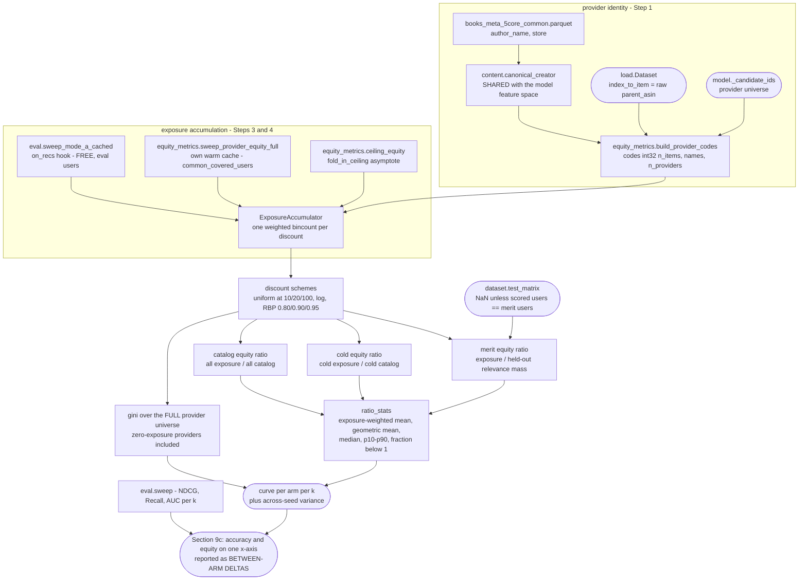

# Who gets exposure, and how do we turn it on?

> **Status: built and run.** Steps 1–7 are complete: `equity_metrics.py` is rewritten,
> `content.canonical_creator` gives it the model's own provider partition, `eval.py` carries the
> `on_recs` hook, `steel_thread.ipynb` has Section 9c, and the results reach W&B, the persisted
> pickle/JSON and the recap. Gated by `bench_28` (22 checks) and `bench_29` (46), both pure CPU.
>
> Section 9c ran clean on 2026-08-11 (`outputs/baseline_cf_20260811_103923`), over **86,791
> providers** and the **12,382** `common_covered_users`, at `equity_metrics v1`. Six arms were
> measured — ALS, Popularity, CBHCF, Intervention A, and Intervention B's `reasoning` and
> `random` — plus the population-sensitivity pass, the seven-discount table, the seed-stability
> diagnostic and `warmup_equity_mode_a.png`. The first 9c attempt crashed on the CBHCF arm; § 2
> is the reversal that crash forced, and the run above is post-fix.
>
> Headline, log discount at `K=100` (levels are a fact about the catalogue; read the between-arm
> deltas): Gini at `k=20` is ALS 0.9950, Popularity 0.9994, CBHCF 0.8785, Intervention A 0.8641,
> both Intervention B arms 0.8785. Across-seed Gini sd is 0.00003–0.00005, so **Intervention A's
> 0.014 reduction sits far outside the seed band and Intervention B's exposure is
> indistinguishable from CBHCF's** — see [What the run showed](#what-the-run-showed).
>
> This document was originally an *integration spec* listing three blockers and four open
> questions. All seven are resolved and recorded below, along with the four defects (§ D1–D5) the
> rewrite fixed — every one of which returned a plausible wrong answer rather than raising, which
> is why they survived. It is kept as the reasoning behind each choice, so a reviewer can argue
> with a decision rather than reverse-engineer it.

**`bench_*` scripts cited below are not in the repo, on purpose** — development-time GPU
verification, not part of the shipped pipeline. See
[05 § Design decisions on record](05-what-metrics-mean.md#design-decisions-on-record).

`eval.py` asks an item-side question: *did the cold item become retrievable?*
`equity_metrics.py` asks the provider-side companion: *whose items are actually getting
recommended, and is exposure concentrating on providers who are already well represented?*
Same `(models, dataset, k_levels)` convention, same curve shape — so it plots on the same
x-axis as the warm-up curve.

The experiment's whole design is that all four arms wrap the **same ten ALS fits** and the
same frozen user factors. So the headline is not the absolute Gini — that is mostly a fact
about the Amazon Books catalogue — but the **difference between arms at matched `k`**, which
is attributable to the item representation and nothing else. Concentration and redistribution
are different questions and the doc reports both.



## Node reference

Line references are given where they are stable; symbols added by this work live in
`recsys/equity_metrics.py` unless noted.

Also in the module and not listed separately: `covered_users` / `common_covered_users` (which
users an arm can be scored on — see § 2) and `EQUITY_METRICS_VERSION` (stamped into persisted
results, since data fingerprints cannot see a change to what a metric means).

| Node | Source | Purpose |
|---|---|---|
| `canonical_creator` | [content.py:174](../recsys/content.py:174) | One definition of "who made this item," shared by the TF-IDF creator role and the equity provider map. Wraps the existing `_clean_entity` and the `author_name → store` fallback. |
| `_clean_entity` | [content.py:107](../recsys/content.py:107) | Strips the `(Author)` role suffix, lowercases, strips punctuation, collapses whitespace, applies the storefront blocklist. Already runs today — but inside the vectorizer, producing tokens rather than a reusable id. |
| `build_provider_map` → `ProviderMap` | `equity_metrics.py` | Returns integer codes, not an object array. This is what makes the full population affordable at all — see § D3. |
| `gini` | rewrite of [equity_metrics.py:70](../recsys/equity_metrics.py:70) | Gini over the full provider universe, zeros included. |
| `discount_weights` | `equity_metrics.py` | Length-`K` position-weight vector per scheme. |
| `ExposureAccumulator` | `equity_metrics.py` | Consumes `rec_ids` per `(k, seed)`, one weighted `bincount` per discount scheme. |
| `equity_ratio_table` | rewrite of [equity_metrics.py:100](../recsys/equity_metrics.py:100) | Exposure share ÷ reference share, with numerator and denominator over the *same* population — see § D4. |
| `ratio_stats` | `equity_metrics.py` | The six summaries that replace the single unweighted mean at [equity_metrics.py:151](../recsys/equity_metrics.py:151). |
| `merit_shares` | `equity_metrics.py` | Provider merit from held-out relevance, `bincount` over `dataset.test_matrix`. |
| `sweep_provider_equity_full` | `equity_metrics.py` | Builds its own warm cache via [cf.py:188](../recsys/cf.py:188) over whatever `users` it is given, and preflights coverage before doing any work. |
| `ceiling_equity` | `equity_metrics.py` | `fold_in_ceiling` analog of [eval.ceiling_reference](../recsys/eval.py:107) — resolves the original spec's ceiling-reference question (§ Open questions → Resolved). |
| `on_recs` hook | [eval.py:315](../recsys/eval.py:315) | Hands the already-computed `rec` to a callback before it is reduced to metrics, so a second measurement over the same lists costs no retrieval. `eval.py` learns nothing about providers. Omitted from the timing line when unused, so a sweep without it prints exactly what it always did. |
| `evaluate_provider_equity_at_k` / `sweep_provider_equity` | [equity_metrics.py:128](../recsys/equity_metrics.py:128), [:156](../recsys/equity_metrics.py:156) | Kept as the generic protocol-only path: needed for the Popularity floor, which has no warm cache, and as the reference implementation `bench_28` checks the fast path against. |

## The five choices that define the measurement

Each of these was implicit in the module as written. Making them explicit is most of the work.

### 1. Provider identity — shared with the model, or it measures nothing

`content.py` already normalizes creators, but as TF-IDF tokens. If equity reads raw
`author_name` off the parquet it partitions the catalogue differently from the way the model
sees it, and the fairness number describes a grouping the model never had access to.

The shared function also fixes coverage: `author_name` alone is 87.9% populated; the
`author_name → store` fallback reaches ~99.5% ([content.py:84-85](../recsys/content.py:84)).
That alone takes `UNKNOWN` from ~12% to ~0.5%.

Two things are deliberately **not** shared:

- **`min_df=2` singleton dropping** ([content.py:42-46](../recsys/content.py:42)) is a
  modelling correctness fix — a term appearing in one item cannot produce item-item
  similarity. For equity the reverse holds: a one-book author with zero exposure is exactly
  what a Gini must count. 57.0% of distinct Books authors are singletons, so sharing this
  would gut the provider universe.
- **The storefront blocklist** ([content.py:73](../recsys/content.py:73)) drops publisher
  storefronts to empty. Here those items become `UNKNOWN` rather than disappearing, so
  catalog share stays a true fraction of the catalogue.

#### Creator tokenization fix (Step 1, changes the models)

Building the shared function surfaced a defect in the tokenization *both* callers depend on.
`_as_entities` split on commas before `_clean_entity` could strip the role suffix, and
`_ROLE_SUFFIX` only matches a suffix ending in `)`, so a multi-role credit split
mid-parenthesis:

```
"Charles Platt (Author)"          -> ['charles platt']                     was correct
"Brandon Graham (Author, Artist)" -> ['brandon graham author', 'artist']   was corrupted
"A (Author, Artist), B (Author)"  -> ['a author', 'artist', 'b']           was corrupted
```

One person therefore tokenized differently depending on how many roles they were credited
with. This was live in the **model's** creator block, not just in equity — reachable wherever
the creator role falls through to `store`, the ~12% of Books items `author_name` leaves empty.
Fixed with `_ENTITY_COMMA`, which splits only on commas outside parentheses; all three cases
above now give `['charles platt']`, `['brandon graham']`, `['a', 'b']`.

**This changes CBHCF and Intervention A.** It invalidates `books_content_tfidf_*`,
`cbhcf_content_*` and `ia_steel_*` in `data/cache/`, and strictly it also invalidates the
lambdas tuned on `cold_val`. Accepted deliberately, with one full re-run afterwards.

Surname-first names remain ambiguous with a two-person list at this layer — `"King, Stephen"`
still yields `['king', 'stephen']`, and primary-entity-wins then picks `king`. Not fixable
without name heuristics or an authority list; pinned by `bench_28` so a future
entity-resolution change has to face the test rather than slip past it. Deeper entity
resolution stays **out of scope** — see § Deliberately not doing.

### 2. Population — the eval users, because the hybrids cannot be scored on any other

**This decision was reversed after the first run crashed, and the original reasoning below was
wrong about what was computable.** The estimand argument still holds: exposure is a count of
impressions across the surface you serve, so the whole population is what one would want, and
eval.py's restriction to users with a held-out item does not transfer (it is exact for a
macro-average; it is not exact for a count).

But CBHCF and Intervention A score their content half from a PRECOMPUTED user x item block
(`cbhcf.build_content_cache`). At Books scale that block is 12,382 users x 246,687 warm items =
**6.1 GB at fp16**, so the full 384,339-user population would be **~189 GB per arm**, and there are
two arms. It is not a budget problem — a block that size could never be swapped onto a 24 GB card,
so widening it would break Section 9's `activate()` scheme as well. `scores.DenseItemBlock` raises
`KeyError` for any user outside the block; the first 9c run died there ten minutes in, on the CBHCF
arm, after ALS had completed.

So **every arm is measured over `equity_metrics.common_covered_users(...)`** — the intersection of
what all arms can score, which is the eval-user set. Measuring ALS over 384k and the hybrids over
12k would make the between-arm difference, the entire point of the section, uninterpretable.

`sweep_provider_equity_full`, `sweep_provider_equity` and `ceiling_equity` all preflight this and
raise in seconds with the numbers above, rather than failing deep inside a score source after doing
most of the work.

**What the restriction costs, measured rather than assumed.** Two consequences, both real:

- the eval users are exactly those holding a held-out *cold* interaction, so they over-represent
  cold-affine taste and will flatter cold-item providers;
- the set is thin — the measured 86,791 providers against 12,382 x K impressions is ~14 each, so
  absolute Gini partly measures small-sample zeros. (This was the argument FOR the full
  population; it now applies to what is actually being reported.)

The run bears the first point out. The population-sensitivity table shows ALS's cold exposure
share falling 4.6% relative when scored over all 384,339 users instead of the 12,382, in the
predicted direction: the eval users hold a held-out *cold* interaction, so they are cold-affine
and inflate cold exposure. Gini itself moves by 0.00016 — but it sits at 0.86–0.999, hard against
its own ceiling, so that agreement is mostly saturation and is weak evidence. **Between-arm
differences are valid and absolute Gini is safe to quote; absolute cold exposure share must be
quoted as an eval-user figure carrying that bias.**

ALS and Popularity *can* be scored both ways, so Section 9c reports a **population sensitivity**
table at k=0 and k=20. Popularity is the control, not a second data point: its ranking is
user-independent, so its delta isolates the effect of *which* users are scored with personalisation
held out, and the gap between ALS's delta and Popularity's is the part attributable to
personalisation meeting cold-affine taste. One arm could not separate those.

**Merit ratio is excluded from that comparison**, and from any run whose scored users are not
exactly the merit users. Merit is derived from `dataset.test_matrix` — i.e. from the eval users —
so dividing full-population exposure by it mixes populations, which is D4 in a new outfit.
`ExposureAccumulator` takes the scored user set, compares it against the merit population, and
returns NaN for the three `merit_ratio.*` statistics when they differ. Catalog share is unaffected:
it counts items, not users.

### 3. Exposure weighting — four schemes, one pass

Uniform-over-top-100 is not the absence of a user model, it is the claim that a user attends
to rank 100 exactly as much as rank 1. Relative weight by rank, and the share of total
exposure mass landing in the top 10:

| scheme | r=1 | r=5 | r=10 | r=20 | r=50 | r=100 | mass in top-10 |
|---|---|---|---|---|---|---|---|
| uniform@100 (module as written) | 1.000 | 1.000 | 1.000 | 1.000 | 1.000 | 1.000 | 10.0% |
| uniform@10 | 1.000 | 1.000 | 1.000 | 0 | 0 | 0 | 100% |
| log `1/log2(1+r)` | 1.000 | 0.387 | 0.289 | 0.228 | 0.176 | 0.150 | 21.7% |
| Zipf `1/r` | 1.000 | 0.200 | 0.100 | 0.050 | 0.020 | 0.010 | 56.5% |
| RBP p=0.95 | 1.000 | 0.815 | 0.630 | 0.377 | 0.081 | 0.006 | 40.4% |
| RBP p=0.90 | 1.000 | 0.656 | 0.387 | 0.135 | 0.006 | 0.00003 | 65.1% |
| RBP p=0.80 | 1.000 | 0.410 | 0.134 | 0.014 | ~0 | ~0 | 89.3% |

**log is the headline**, for a coherence reason rather than a behavioural one: the accuracy
metric is NDCG, which uses exactly `1/log2(1+r)`. Sharing the discount means the accuracy
curve and the equity curve describe the same hypothetical user; mixing NDCG@100 with
RBP-weighted exposure puts two different users in one figure. **uniform** is reported as the
no-model baseline and for continuity. **RBP p=0.90** is the behaviourally-motivated one — its
parameter has a meaning (expected examination depth `1/(1-p)` ≈ 10 items), so it can be argued
with directly; p ∈ {0.80, 0.95} is the sensitivity band.

Cascade models (ERR, DBN) are rejected: the discount becomes relevance-dependent and per-list,
so exposure stops being a fixed weight vector, and with sparse binary held-out relevance most
lists contain nothing relevant, the cascade never terminates, and it degenerates toward `1/r`.
Empirical position-bias curves are the right answer when you have impression logs; Amazon
Reviews 2023 is a review corpus with none. Both belong in the limitations paragraph.

Extra `K` values are free — top-10 ⊂ top-100, so uniform@10 and @20 are truncations of the
same array with no rescoring.

**Caution for the writeup:** Gini on discounted exposure is *mechanically* higher than on
uniform exposure, because the mass was concentrated before its concentration was measured.
Schemes are comparable only within-scheme across arms. A move from 0.82 to 0.91 that is
really a change of weight vector must not be read as a finding.

### 4. What counts as fair — three reference shares

`equity_ratio` encodes *item-proportional* fairness: you deserve exposure in proportion to how
many items you have. Defensible and transparent, but it implies a provider who uploads 10,000
items deserves 10,000× the attention. So three reference shares are reported:

1. **Catalog share, all items** — the transparent baseline.
2. **Catalog share, cold items only** — the population the interventions target.
3. **Merit share** — `merit_p = Σ rel(u,i)` over that provider's items, with `rel(u,i) = 1`
   iff `(u,i) ∈ test_matrix`. Computed both over all held-out interactions and cold-only.
   Restricted to providers with nonzero merit, since with 13,635 cold held-out interactions
   across 136,602 providers most merit is zero.

Model scores as relevance is rejected as circular — grading a model's fairness against its own
relevance estimate is close to vacuous. Training-set degree as merit is rejected for the
headline: it defines deserved exposure as historical popularity, which prejudges the
rich-get-richer question. It stays available as a named contrast.

**The discount must match.** A position-discounted numerator over an undiscounted merit
denominator reintroduces § D4 in a new form. The merit target is the exposure the relevant
items would receive under an ideal ranking, built with the same weight vector.

### 5. Aggregation — six summaries, not one mean

The single unweighted mean over providers at
[equity_metrics.py:151](../recsys/equity_metrics.py:151) is dominated by the thousands of
one-book authors, each contributing a wildly noisy ratio. Reported instead:

| Statistic | What it answers |
|---|---|
| Exposure-weighted mean, `Σ_p exposure_share_p × ratio_p` | What the average *impression* sees. Head-dominated by construction — that is the point. |
| Unweighted mean | What the average *provider* gets. Kept for continuity; noisy. |
| Geometric mean | Central tendency that respects the fact that ratios are multiplicative. |
| Median, p10/p25/p75/p90 | The distribution the means collapse. |
| Fraction with ratio < 1 | Blunt headline: what share of providers are under-exposed relative to footprint. |

Ratios must not be averaged in linear space beyond the exposure-weighted one: 4× and 0.25×
average to 2.1×, not 1.0. Percentiles are invariant to this, so they are safe as reported.

## Defects in the module as it stands

### D1 — item-id format mismatch (silent, returns a wrong answer)

`load_provider_metadata` builds its index with a domain prefix
([equity_metrics.py:43](../recsys/equity_metrics.py:43), [:48](../recsys/equity_metrics.py:48)),
but `load.load_dataset` builds `index_to_item` from the **raw, unprefixed** `parent_asin`
([load.py:238](../recsys/load.py:238)). Every lookup misses and every item maps to `"UNKNOWN"`.

This does not raise. One provider holds 100% of exposure and 100% of catalog share, so
`gini_coefficient` of a single-element array returns `0.0` and the ratio returns `1.0` —
literally "perfectly equitable exposure." The most dangerous possible failure mode for a
fairness metric.

The prefixed convention comes from `notebooks/data_cleaning.ipynb`, which builds a unified
books+movies item table with `book_`/`movie_` ids. (The previous version of this doc said that
notebook was deleted in `f61dfca`. It is not — it is on disk and still produces prefixed ids.
What is true is that it is **not on the current path**: `load.load_dataset` reads
`books_5core_common.parquet`, produced by `data_filtering.ipynb`, with raw `parent_asin`. So
the conclusion is unchanged — nothing feeding this pipeline produces prefixed ids — but the
reason is "different pipeline," not "deleted file.")

**Resolution:** drop the prefixes, Books-only. Prefixes only return if a combined books+movies
`Dataset` is ever built from `data_cleaning.ipynb`'s table. The `assert unknown_frac < 0.02`
gate in Section 9c is not optional regardless.

### D2 — Gini omits providers who received nothing

`provider_exposure_counts` ([equity_metrics.py:82](../recsys/equity_metrics.py:82)) returns
`value_counts()`, which drops zero-exposure providers entirely. With 136,602 providers and a
heavy-tailed recommender, most receive nothing — and they are precisely the observations a
Gini exists to count. The reported inequality comes out drastically too *equal*.

**Resolution:** `np.bincount(codes, minlength=n_providers)` over the fixed universe of every
provider with ≥1 item in the candidate pool. `bench_28` carries a regression case.

### D3 — 38.4M Python string hashes per `(seed, k)`

`provider_of[flat_items]` on a `dtype=object` array builds a 38.4M-element array of string
references, and `pd.Series(...).value_counts()` hashes all of them. Order 30–60 s per
`(seed, k)`, times 210, times four arms — most of a day, and the reason the full population
looked infeasible. It is a property of the dtype, not of the user count: with integer codes
the same step is a `bincount` at ~0.3 s.

**Resolution:** integer codes throughout. The full population then costs ~10–20 min of GPU
work plus ~7 min of counting.

### D4 — `equity_ratio` divides shares with different denominators

`exposure_share` is over *all* recommendations (overwhelmingly warm items); `catalog_share` is
over *cold items only* when the mask is passed
([equity_metrics.py:105-110](../recsys/equity_metrics.py:105)). A large warm publisher with
one cold title collects a huge ratio from warm exposure it never earned in the cold catalogue,
and `cold_equity_ratio_mean` is dominated by exactly those.

**Resolution:** two clean ratios, each with numerator and denominator over the same
population — § "What counts as fair" above.

### D5 — host RAM at full population

`_warm_cache` ([cf.py:188](../recsys/cf.py:188)) is stored per model and never freed. At
384,339 users it is 460 MB per seed; ten live seeds is 4.6 GB. Not a defect at the eval-user
scale where it is 15 MB. **Resolution:** clear it after each seed in the full-population pass.

## Ranking stochasticity — noted, not fixed

A deterministic top-K makes some of the measured inequality an artifact of the serving rule.
Two items whose scores differ by 1e-9 land at ranks 1 and 2; under a log discount that is a
~60% attention gap generated by noise. And every user with similar taste receives the
identical list, so concentration is guaranteed before the model contributes anything.

The theoretical fix is a stochastic ranking policy evaluated on *expected* exposure — Singh &
Joachims (KDD 2018), whose LP over doubly-stochastic matrices is Birkhoff–von Neumann
decomposed into servable permutations; or Plackett–Luce sampling, under which a 1e-9 score gap
produces a 1e-9 exposure gap; with the metric side from Diaz et al. (CIKM 2020).

**Not done here**, because it changes the *serving policy*, not the metric: once rankings are
stochastic, NDCG/Recall/AUC must be re-measured under the same policy or the figure describes
two different systems. That is a separate experiment.

**Done instead, for free:** per-provider exposure share is computed separately for each of the
ten seeds and its across-seed variance reported. If Gini is stable across seeds while
individual providers' shares swing, the concentration is real but the identity of who occupies
the head is substantially arbitrary — which is the near-tie amplification, measured directly.

## Design notes preserved from the original spec

**Why `author_name`, not `main_category`/`categories`.** Category fields describe what an item
*is* (genre, type), not who *made* it; using them would conflate content-type equity with
provider equity.

**Why `store` is not used as a provider field on its own.** On Books it is mostly an author
page (91.9% of values map to a single author) but is contaminated by publisher storefronts,
which would make every DK Publishing title "by the same creator"
([content.py:70-76](../recsys/content.py:70)). It is used only as the fallback when
`author_name` is empty, and the blocklist catches the known storefronts. Movies' `store` holds
a cast list and is not an author analog at all — one more reason this is Books-only.

**Why `"UNKNOWN"` instead of dropping.** Every item keeps a row, so catalog share stays a true
fraction of the catalogue. Right choice — and also precisely what makes D1 silent.

**`RENAME PENDING` markers.** Three sites
([equity_metrics.py:134](../recsys/equity_metrics.py:134),
[:138](../recsys/equity_metrics.py:138), [:168](../recsys/equity_metrics.py:168)) note that
`k` means interaction count here, matching `eval.py`, and that renaming to `n` should wait
until `eval.py`'s `k` is renamed too. Keep them in step; the rewrite carries them forward.

## Implementation steps

| Step | Deliverable |
|---|---|
| 1 | **Done.** `content.canonical_creator` + `bench_28_creator_entities.py`. No vectorizer refactor was needed — the function composes `build_documents` and `_entity_analyzer`, which the vectorizer already uses, so the shared definition flows the right way with no risk to CBHCF/IA. Also fixed `_as_entities`' comma split (§ Creator tokenization fix). |
| 2 | **Done.** `recsys/equity_metrics.py` rewritten: `ProviderMap` integer codes, D2/D4 fixes, seven discounts, three reference shares, `ratio_stats`, `ExposureAccumulator`. |
| 3 | **Done.** `on_recs(ki, si, rec)` in `eval.sweep_mode_a_cached`, with its own timing bucket. Every existing caller passes the first three arguments positionally and the rest by keyword, so the trailing parameter is backwards-compatible. |
| 4 | **Done.** `sweep_provider_equity_full` (own warm cache, whole population, D5 clear per seed) + `ceiling_equity` via `fold_in_ceiling`. Both reuse `fold_in`'s memo, so running in the same session as Section 9's sweep makes the fold-ins free. |
| 5 | **Done.** `bench_29_provider_equity.py` — 46 checks, pure CPU: equity primitives, D1/D2/D4 regressions, hook mechanics, cached-vs-generic parity, D5, the ceiling, and the no-warm-cache guard. |
| 6 | **Done and run.** Notebook Section 9c — provider map + the `UNKNOWN` assert, an eval-user pass per arm plus its ceiling (§ 2, not the full-population pass this row originally described), the readout, the discount-sensitivity table, the seed-stability diagnostic, and `warmup_equity_mode_a.png`. Popularity and Intervention B are behind flags; both were **on** for the recorded run (`RUN_POP_EQUITY = True` now that the generic path's cost is measured, `RUN_IB_EQUITY = RUN_IB`). Intervention B's arms borrow CBHCF's ceiling rather than recomputing it — the synthetic wrapper overrides the reveal path only, so at the ceiling every cold item folds in from real history and the two are identical by construction. |
| 7 | **Done.** W&B `equity/*` against step `k` on each arm's run (plus ceiling and per-discount Gini as summaries), `results["mode_a"]["equity"]` with `EQUITY_METRICS_VERSION` in the config block, a RESULTS RECAP section, Section 12 prose, and this doc. `pop_run.finish()` moved from Section 9 to 9c so Popularity's equity arm is logged before its run closes. No README change needed — `books_meta_5core_common.parquet` was already in the data table; the 0-core file the original spec asked for is not used. |

**Cost, as estimated:** ~10–20 min GPU across four arms, ~7 min counting. **Measured on the
2026-08-11 run:** 3 min 52 s for the four sweep-plus-ceiling arms over 12,382 users (26–37 s per
`sweep_provider_equity_full`, 2.6–4.6 s per `ceiling_equity`), plus 58 s for the full-population
sensitivity pass. The extra discount schemes, the extra `K` values and the merit baselines are
free, as predicted.

**Ordering constraint:** `pop_run.finish()` fires at the end of notebook cell 23. Either the
Popularity equity arm logs inside Section 9, or that `finish()` moves to 9c.

## Deliberately not doing

- **Author entity resolution** beyond the existing normalization. It would plausibly help
  retrieval too — 57% singletons suggests recoverable mass — but it changes the item
  representation, so it invalidates CBHCF and Intervention A, needs a lambda re-tune on
  `cold_val`, and a full re-run. Its own experiment.
- **Stochastic ranking policies** — see above.
- **Movies, a combined item table, and therefore prefixed item ids.**

## What the run showed

Section 9c, 2026-08-11, six arms. The between-arm differences are far outside the across-seed
band — Gini sd across the 10 ALS fits is 0.00003–0.00005, against Intervention A's 0.014
reduction versus CBHCF — so these are differences worth reporting, not noise.

**Intervention A measurably de-concentrates exposure.** Gini 0.8641 vs CBHCF's 0.8785, top-1%
share 0.494 vs 0.560, cold equity ratio 3.86 vs 2.18 at `k=20`. It also holds *less* absolute
cold exposure share (0.0206 vs 0.0250), so it spreads a smaller cold slice more evenly. The two
move in opposite directions and the writeup has to say both.

**Intervention B does not change provider exposure at all** — a null that should be reported
rather than dropped. Its `reasoning` and `random` arms agree with CBHCF and with each other to
four decimals on every column. That is consistent with the accuracy result: 19,089 synthetic
interactions against `ref_train`'s 2.67M cannot move an exposure distribution.

**The direction of the trade is the interesting part.** Intervention A loses NDCG@100 and gains
equity. That is a genuine trade-off to state, not a wash.

## Drift

None outstanding. The three items previously listed here were fixed by the Step 2 rewrite rather
than merely reported: the `data_cleaning.ipynb` id-convention docstring (which was D1, and whose
"deleted in `f61dfca`" claim was itself wrong — see § D1), `_check_model`'s reference to a
nonexistent `score_matrix` protocol method, and the module docstring citing
`recall_and_hit_rate_at_k` instead of `mode_a_metrics_at_k`.

## Open questions

### Resolved since the original spec

- **Scope** — Books only (§ D1).
- **Population** — the eval users, with the full population kept as a free robustness check on
  the two arms that can be scored both ways (§ 2). This is the *reverse* of what this line said
  before the first run.
- **Ceiling reference** — `ceiling_equity` (Step 4).
- **Aggregation** — `nanmean` plus six summaries, replacing the bare mean (§ 5).
- **The Popularity floor's cost** — measured, not assumed. `PopularityModel.recommend` is
  vectorized over a global top-M, so a full-population level costs 2.3 s at max user degree ~500
  and 13.4 s at ~5,000: 0.8–4.7 min for 21 levels. On by default, and the most interpretable
  comparator here — Popularity serves every user the same list, so its Gini is the concentration
  ceiling.
- **Whether the equity numbers are worth reporting at all** — yes, and by a wide margin. See
  [What the run showed](#what-the-run-showed).

### What remains genuinely open

1. **RBP `p`.** Defaulted to 0.90 with a {0.80, 0.95} sensitivity band. There is no
   Books-specific evidence for any value; the band is the honest representation of that.
2. **Merit sparsity.** With 13,635 cold held-out interactions across the provider universe, merit
   share is a noisy estimate for every provider near the threshold. The run confirms the ratio is
   *available* — scored users equal the merit population, so `ExposureAccumulator` returns it
   rather than NaN — but it is absent from the Section 9c readout, so whether it survives that
   noise well enough to report as more than a directional check is **still open**. It needs a
   dispersion readout (`ratio_stats`' p10–p90 and fraction-below-1) before anyone quotes it.
