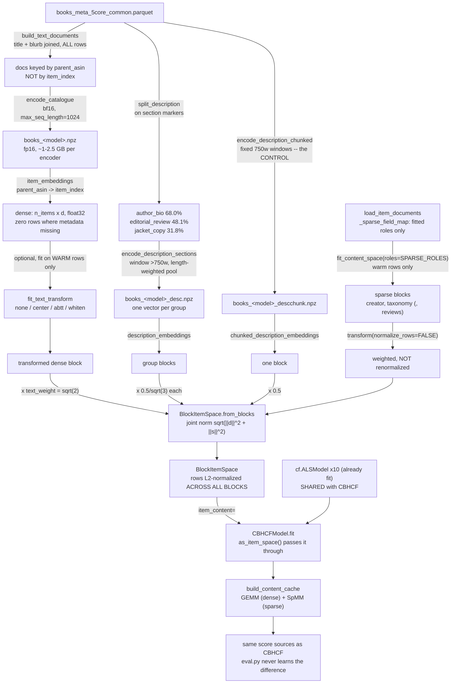

# How does Intervention A replace TF-IDF with sentence embeddings?

By swapping **one block** of the item representation and holding everything else fixed. Intervention
A wraps the *same* ALS fits as CBHCF, uses the same frozen user profile, the same `lambda` mechanism
and the same evaluation path — so any difference between their warm-up curves is attributable to the
item representation and nothing else. At `lambda = 0` the two are the identical model, verified to
five decimals on `cold_val`.

The mechanism that makes this possible is `item_space.py`: `cbhcf.py` used to hold a sparse
item x term matrix directly and assume every product was sparse. It now talks to an interface with
two questions — *what setup can be done once per item block?* and *what is the score for these users
against that block?* — so it is agnostic to whether the content model behind it is sparse, dense, or
both. A raw CSR passed to `CBHCFModel.fit` is wrapped in `SparseItemSpace`, whose arithmetic is
literally the lines `cbhcf.py` used to run inline, which is what keeps every pre-existing result
reproducible.

**Not every field goes to the encoder, and that is the central design decision.** Measured over all
487,790 Books items:

| role | column | populated | length | treatment | why |
|---|---|---|---|---|---|
| `title` | `title` | 100% | 8 w | **encoder** | prose, read in context with the blurb |
| `blurb` | `features` | 98.0% | 173 w | **encoder** | 243 tokens mean with title, p99 813 — fits a window whole |
| `reviews` | `description` | 73.5% | 847 w | **encoder** (section-split) | free text, so no principled reason to stay lexical |
| `creator` | `author_name`→`store` | 99.5% | 2–5 w | TF-IDF entity | 136,602 distinct authors; **exact** match is the correct semantics |
| `taxonomy` | `categories` | 98.2% | 7 w | TF-IDF entity | controlled vocabulary of 1,269 paths; an encoder would blur "Fantasy" into "Science Fiction" |

## Node reference

| Node | Source | Purpose |
|---|---|---|
| `as_item_space` | [item_space.py:48](../recsys/item_space.py:48) | Accepts a raw CSR **or** an `ItemSpace`. A raw matrix wraps to `SparseItemSpace`, so every existing caller is unchanged — `bench_21` gates this as bit-identical. |
| `SparseItemSpace` | [item_space.py:61](../recsys/item_space.py:61) | `content.py`'s output and the pre-Intervention-A behaviour. Every method is the code `cbhcf.py` previously ran inline. |
| `BlockItemSpace.from_blocks` | [item_space.py:125](../recsys/item_space.py:125) | **The** constructor. Takes *unnormalized* weighted blocks and divides by the single joint norm. Normalizing each half separately would also produce unit rows and run without error — it would just silently discard the weighting *between* them. |
| `BlockItemSpace.scores` | [item_space.py:178](../recsys/item_space.py:178) | `(H @ D) @ D[items].T + (H @ S) @ S[items].T` — the factorization distributed over the blocks. An identity, not an approximation; gated in `bench_21`. |
| `ContentSpace.transform(normalize_rows=False)` | [content.py:189](../recsys/content.py:189) | Added for this intervention. The sparse blocks are now only *part* of a wider space, so renormalization has to span every block at once. |
| `fit_content_space(roles=...)` | [content.py:225](../recsys/content.py:225) | Restricts which roles are fitted. A role must be represented **once** or the field would be double-counted in the item's norm. |
| `TEXT_ROLES` / `SPARSE_ROLES` | [intervention_a.py:100](../recsys/intervention_a.py:100), [:103](../recsys/intervention_a.py:103) | Must partition the roles in use. `blurb` resolves to Books `features` and Movies `description` — addressing **roles**, not columns, is what lets one code path serve both catalogues. |
| `DEFAULT_TEXT_WEIGHT` | [intervention_a.py:109](../recsys/intervention_a.py:109) | `sqrt(2)`, not 2.0 — see **Why the text weight is sqrt(2)** below. |
| `ENCODERS` | [intervention_a.py:211](../recsys/intervention_a.py:211) | The six-model slate, with per-model batch sizes that are **measured, not guessed**: bigger is not better, because `encode` pads each batch to its longest member. |
| `encode_catalogue` | [intervention_a.py:260](../recsys/intervention_a.py:260) | Encodes every row of a metadata file, keyed by `parent_asin`. Idempotent. Stored fp16: a normalized vector's components sit near `1/sqrt(d)`, comfortably inside fp16. |
| `split_description` | [intervention_a.py:155](../recsys/intervention_a.py:155) | One `description` string → `{group: text}`, **losing nothing** — preamble and unrecognised headings route to `jacket_copy`. |
| `DESCRIPTION_GROUPS` | [intervention_a.py:126](../recsys/intervention_a.py:126) | Fourteen headings collapsed to three blocks. A block present for 1% of the catalogue costs 1,024 dense columns and buys almost nothing. |
| `encode_description_sections` | [intervention_a.py:317](../recsys/intervention_a.py:317) | One vector **per section group** per item, so the caller can keep the groups separate *or* pool them without touching the GPU again. |
| `encode_description_chunked` | [intervention_a.py:416](../recsys/intervention_a.py:416) | The control: same text, same weight, same width — cut on fixed windows instead of section boundaries. Isolates exactly one question. |
| `item_embeddings` | [intervention_a.py:542](../recsys/intervention_a.py:542) | Places ASIN-keyed vectors into `item_index` order. Items with no metadata row get an all-zero vector, which `from_blocks` lets the other blocks' weight absorb. |
| `fit_text_transform` | [intervention_a.py:575](../recsys/intervention_a.py:575) | Warm-only anisotropy correction (`center` / `abtt` / `whiten`). Off by default — see **Measured, then not adopted** below. |
| `_sparse_field_map` | [intervention_a.py:676](../recsys/intervention_a.py:676) | Restricts document loading to roles that will actually be fitted. Without it, `load_item_documents` re-reads and flattens the 847-word `description` column purely to discard it. |
| `build_space` | [intervention_a.py:689](../recsys/intervention_a.py:689) | Assembles the whole space. `description_mode` selects `tfidf` / `chunked` / `pooled` / `sections`. |
| `build_content_cache(build_mode_b=False)` | [cbhcf.py:170](../recsys/cbhcf.py:170) | Added for the selection runs, which read only Mode A. Building Mode B for a candidate costs minutes and ~2 GB to produce a block nothing reads; `mode_b_source()` then raises rather than returning silently wrong scores. |

## Why the text weight is sqrt(2)

Weights enter this space **squared** — `content.py`'s own identity is
`cos(i,j) = sum_f w_f^2 cos_f(i,j) / (||i|| ||j||)` — so a block's share of an item's squared norm is
`w_f^2`, not `w_f`.

The baseline's shares are title 1, creator 1, taxonomy 0.25, blurb 1, reviews 0.25, totalling 3.5, of
which prose (`title` + `blurb`) is `2/3.5 = 57.1%`. Reproducing that with a single merged block needs
`w^2 = 2`, i.e. `w = sqrt(2)`. Which is also the geometric statement of what merging two roles does:
two orthogonal unit blocks combine to norm `sqrt(1^2 + 1^2)`.

Setting it to the intuitive "1 + 1 = 2" would hand the dense block `4/5.5 = 72.7%` of the norm —
over-weighting prose by a quarter against the baseline, so part of any measured gain would be that
reweighting rather than the representation. `bench_21` gates the share against the baseline's.

## The slate, and why five otherwise-good encoders are missing

Every model in the slate has a context window of **at least 1,024 tokens**. The encoded document
averages 243 tokens with p99 at 813, so a 1,024-token floor puts ~p99 inside every model's window and
removes window size as a confound. That ruled out MiniLM (256), mpnet (384), and the 512-token
`bge-base-en-v1.5` / `e5-base-v2` / `mxbai-embed-large-v1`.

Two more were ruled out by the environment rather than by merit: `Alibaba-NLP/gte-*-en-v1.5` and
`jinaai/jina-embeddings-v3` both fail under transformers 5.x (a RoPE table indexed out of bounds; a
missing `all_tied_weights_keys` attribute). `google/embeddinggemma-300m` is a gated repo. This is
recorded in `requirements.txt` so the exclusions are not mistaken for findings.

`Snowflake/snowflake-arctic-embed-l-v2.0` was selected on `dataset.cold_val` by
`intervention_a_model_selection.ipynb`, winning by 14% over the runner-up. A 4B-parameter model
placed **second**, so scale did not decide it.

All six are encoded at **bfloat16**. That is a real trade, not a free one: bf16 agrees with fp32 to a
per-item cosine of 0.99993 but still reshuffles ~4% of top-10 item neighbours. It is used because
`Qwen3-Embedding-4B` cannot be loaded in fp32 on a 24 GB card at all (16.1 GB of weights before
activations), and because a **uniform** dtype means that perturbation applies identically to all six
and so cannot favour one.

## Measured, then not adopted

Two ideas were implemented, measured, and left switched off. Both are kept because the measurement is
the useful artifact.

**Anisotropy correction** (`fit_text_transform`, gated by `bench_22`). Sentence embeddings are often
anisotropic — all vectors in a narrow cone — which compresses the usable range of a cosine. Measured
on arctic's actual output, that is **not** the case here: mean pairwise cosine 0.19, top direction
holding 3.3% of variance. And the standard corrections make it *worse* by the metric that matters —
whitening collapses the p1–p99 cosine spread from 0.383 to 0.150, flattening informative directions
down to the noise floor. Default is `"none"`.

**Section structure for `description`.** Four treatments — TF-IDF, naive chunking, section-pooled,
section-separate — land within **0.5%** of each other, despite the section blocks carrying genuinely
distinct information (inter-block cosines 0.36–0.54). Note the scope: `reviews` carries `w = 0.5`,
i.e. 7.1% of an item's squared norm, so this shows *how* the field is represented does not matter at
its baseline weight. It does **not** show the field is worthless — a later weight sweep found
deleting it entirely costs 1.6–6.6%, and its optimum is `w = 1.0`, double the default.

## What it produced

Both arms had their field weights searched on an **identical** grid
(`intervention_a_weight_sweep.ipynb`), so neither enters `steel_thread.ipynb` with a tuning
advantage — the asymmetry `hyperparameter_tuning.ipynb` already warns about for ALS. Both improved by
~3.5%; the gap between them barely moved.

Cold **test**, 10 seeds, at each arm's selected weights and lambda:

| | NDCG objective | NDCG @ k=0 | AUC @ k=0 |
|---|---|---|---|
| CBHCF (TF-IDF) | **0.04332** | **0.0419** | 0.7682 |
| Intervention A (arctic) | 0.03733 | 0.0355 | **0.7767** |

**The split is consistent at every reveal level and in both evaluation modes**: Intervention A loses
~15% on NDCG@100 and HitRate@100 and leads AUC by ~1.1%. Exact rare-token matching (series names,
characters, authors) yields a few very high-precision hits that land inside the top 100; embeddings
lift the whole cold population's rank modestly, which AUC rewards and NDCG@100 cannot see. Which
representation is "better" depends on whether the deployed surface is a short top-N list or a full
ranking. For top-N cold-start retrieval — this project's framing — TF-IDF still wins.

## Drift

- The doc table in the repo `README.md` describes these docs as "seven Mermaid diagrams". With this
  file and `08-intervention-b-coldllm.md` there are now eight.

**Two weights, both correct — read the label.** `DEFAULT_TEXT_WEIGHT` is `sqrt(2)`, the *parity*
value that gives an untuned Intervention A exactly the baseline's 57.1% prose share, so a no-tuning
comparison isolates the representation. `steel_thread.ipynb` runs at **2.0**, selected on
`cold_val` by the matched-budget sweep and recorded in `hyperparams.json["steel_thread_config"]`.
Anything that builds a space without passing `text_weight` gets the parity default. This was
previously a genuine drift (the docstring documented only `sqrt(2)` while the reported numbers used
2.0) and is now stated in both places —
[intervention_a.py:49](../recsys/intervention_a.py:49) and
[intervention_a.py:109](../recsys/intervention_a.py:109).

## Open questions

- **The warm-up curve is nearly flat for both hybrids** (~5–7% from `k=0` to `k=20`) while ALS's AUC
  climbs 78% over the same sweep. `cbhcf.fold_in` explains why: *"the content term is entirely
  static"* — content contributes the same value at every `k`, so no improvement to the content
  representation can change the *shape* of the curve, only its height. An intervention that changes
  the shape has to reach the collaborative pathway.
- **Whether `description` deserves more weight is unresolved.** The sweep says `w = 1.0` beats the
  default 0.5, but that value was selected on `cold_val` and has not been carried into
  `content.DEFAULT_WEIGHTS`, so the baseline still ships 0.5.
- **Movies is encoded but unused.** `content.py`'s role indirection exists to support a Books →
  Movies transfer run; the embeddings are keyed by `parent_asin` and split-independent, so that run
  needs no GPU work. Nothing currently consumes them.
