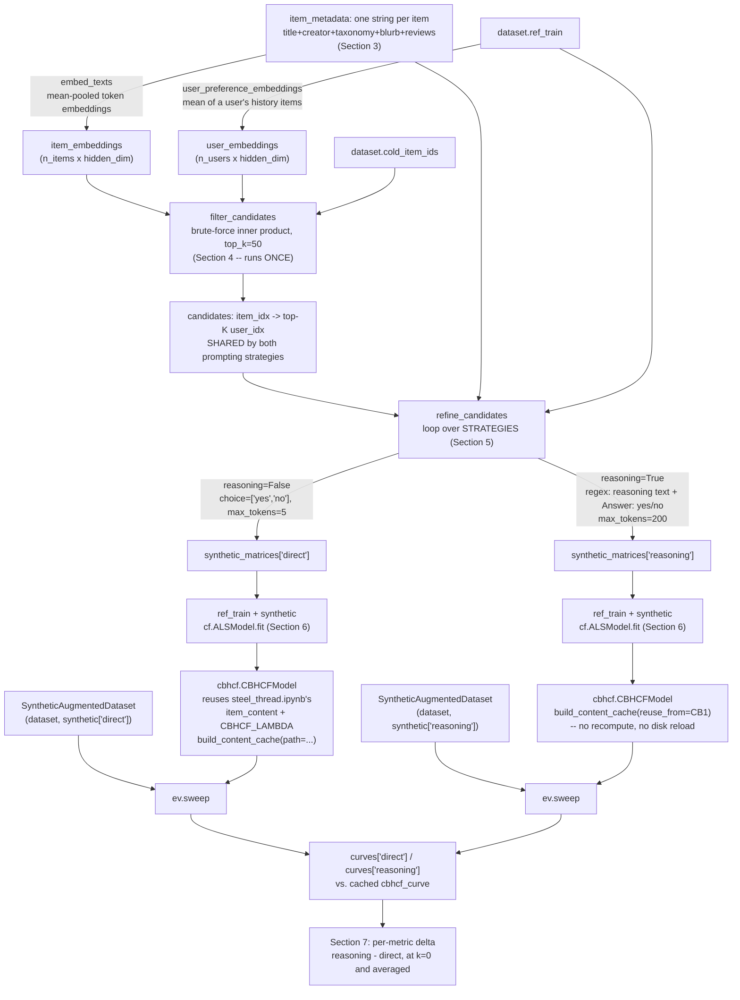

# How does Intervention B generate synthetic interactions for cold items?

A two-stage funnel, following ColdLLM ([arXiv:2402.09176](https://arxiv.org/abs/2402.09176)):
**Filtering Simulation** narrows every cold item's candidate pool from all users down to the
top-K most content-similar, then **Refining Simulation** asks an LLM a yes/no for each
surviving (item, user) pair. Positive answers become a synthetic interactions matrix, added to
`ref_train` before fitting ALS — giving a cold item something to learn from *before* it has
accumulated a single real interaction, which is exactly the case
[05-what-metrics-mean.md](05-what-metrics-mean.md) and `steel_thread.ipynb`'s own fold-in
sweep show ALS's `recalculate_item` cannot help with at all (its closed-form solve returns the
exact zero vector at `k=0`).

Both stages run against the **same LLM**, in-process via vLLM (`from vllm import LLM`, not a
server) — Filtering uses it in `task="embed"` mode (mean-pooled token embeddings), Refining in
`task="generate"` mode. This matches the paper's own design (Sec 4.2.1): it does not use a
dedicated embedding model either. `recsys/coldllm.py` implements it; the notebook that drives
it is `notebooks/intervention_b_coldllm.ipynb`.

**Two Refining prompting strategies share one code path and one notebook run**, forking only at
the Refining stage: **B1 (direct)** asks the bare yes/no question with choice-constrained
decoding; **B2 (reasoning)** asks for a one-sentence justification first, with regex-constrained
decoding. Everything upstream (dataset, cached CBHCF baseline, item metadata, Filtering) and
downstream (the comparison) is shared and computed once — see the notebook's Section headers in
the table below.

## Node reference

| Node | Source | Purpose |
|---|---|---|
| `VLLMColdLLMSimulator` | [coldllm.py:31](../recsys/coldllm.py:31) | Two lazily-built vLLM engines loading the SAME model — `generate` for Refining, `embed` (mean pooling) for Filtering. Lazy so a simulator used for only one stage never pays for the other engine's GPU memory. |
| `embed_llm` / `generate_llm` | [coldllm.py:61](../recsys/coldllm.py:61), [coldllm.py:68](../recsys/coldllm.py:68) | The lazy-construction properties — built on first access, cached after. |
| `embed_texts` | [coldllm.py:78](../recsys/coldllm.py:78) | Mean-pooled embedding per text, via vLLM's `pooling_type: MEAN` — ColdLLM's Eq. 7, computed by vLLM's pooling engine rather than by hand. |
| `user_preference_embeddings` | [coldllm.py:137](../recsys/coldllm.py:137) | Mean of a user's training-history item embeddings — same "average a bunch of vectors into one" operation as mean pooling, one level up (items, not tokens). |
| `filter_candidates` | [coldllm.py:149](../recsys/coldllm.py:149) | Brute-force inner product + `argpartition`, matching the paper's own Eq. 17 (not an approximation chosen for lack of FAISS). |
| `_build_prompt` | [coldllm.py:169](../recsys/coldllm.py:169) | `reasoning` flag toggles whether a "give a one-sentence reason first" instruction is appended. |
| `yes_probability` | [coldllm.py:94](../recsys/coldllm.py:94) | The two decoding strategies — see **Two prompting strategies** below. |
| `_parse_final_answer` | [coldllm.py:192](../recsys/coldllm.py:192) | Pulls the **last** `Answer: yes/no` match out of a reasoning completion (in case the reasoning text itself echoes the word). |
| `refine_candidates` | [coldllm.py:202](../recsys/coldllm.py:202) | Stage 2 end to end: builds one prompt per surviving pair, thresholds `yes_probability`'s output, returns a sparse synthetic matrix. |
| `SyntheticAugmentedDataset` | [coldllm.py:246](../recsys/coldllm.py:246) | Wraps `dataset` so `fold_in()` sees synthetic interactions at every `k`, including `k=0` (where `fold_in`'s own closed-form solve would otherwise return zero). |
| `revealed_item_users_at_k` override | [coldllm.py:284](../recsys/coldllm.py:284) | The **only** method overridden — see **Keeping synthetic data out of the exclusion set** below. |
| Section 4 (Filtering) | `notebooks/intervention_b_coldllm.ipynb` | Embeds the full catalog and computes `candidates` **once** — Filtering doesn't depend on the Refining prompting strategy at all. |
| Section 5 (Refining) | `notebooks/intervention_b_coldllm.ipynb` | Loops `STRATEGIES = ["direct", "reasoning"]`, caching each strategy's synthetic matrix under a key that includes the strategy name so they never collide. |
| Section 6 (warm-up curve) | `notebooks/intervention_b_coldllm.ipynb` | Fits one ALS + `CBHCFModel` per strategy; the second strategy's content cache is borrowed via `reuse_from`, not recomputed. |
| `build_content_cache` / `reuse_from` | [cbhcf.py:164](../recsys/cbhcf.py:164) | The content half of CBHCF's score is independent of the collaborative model, so it's built once and shared across both strategies' `CBHCFModel` instances. |
| `sweep` | [eval.py:240](../recsys/eval.py:240) | The same warm-up sweep machinery `steel_thread.ipynb` uses, run here against `SyntheticAugmentedDataset` instead of the plain `Dataset`. |

## Two prompting strategies

Both live behind one `reasoning` flag threaded through `_build_prompt` /
`yes_probability` / `refine_candidates` — nothing about Filtering, the CBHCF wrap, or the
sweep machinery differs between them.

| | B1 — direct | B2 — reasoning |
|---|---|---|
| Prompt | Bare yes/no question | Same question + "give a one-sentence reason, then answer on a final line" |
| Decoding constraint | `GuidedDecodingParams(choice=["yes", "no"])` — the *entire* completion is one of those two strings | `GuidedDecodingParams(regex=...)` — free text up to ~600 chars, followed by a mandatory `Answer: yes`/`Answer: no` line |
| `max_tokens` | 5 | 200 |
| Parsing | None needed — the output IS the answer | `_parse_final_answer` extracts the last `Answer:` match |
| Cost | Cheaper — same call count as B2, far fewer tokens per call | Meaningfully slower for the same call count |

Neither produces a smooth confidence score — both resolve to a hard 0.0/1.0 per prompt. The
paper's own Refining model is LoRA-fine-tuned; this implementation is zero-shot for both
strategies, so there's no calibrated probability to threshold either way.

## Keeping synthetic data out of the exclusion set

`refine_candidates()`'s output is data, not a scorer — it is meant to be added to whatever
matrix an existing model (`cf.ALSModel`, `cbhcf.CBHCFModel`) is fit or folded on, the same slot
`Dataset.revealed_matrix_at_k(k)` already occupies. It must **never** be folded into whatever
matrix `eval.py` treats as "already interacted" for `recommend()` / `ndcg_at_k` /
`recall_and_hit_rate_at_k` / `auc_at_full`. Unlike real revealed history — guaranteed disjoint
from `dataset.test_matrix` by `load.py`'s reveal/reserve split — a synthetic interaction has no
such guarantee, so masking with it would risk silently excluding the exact test-set items being
measured.

This is why `SyntheticAugmentedDataset` overrides **only** `revealed_item_users_at_k`
([coldllm.py:284](../recsys/coldllm.py:284)), which `fold_in()` uses to recalculate cold-item
factors, and deliberately leaves `revealed_matrix_at_k` untouched — that method is what
`eval.py` separately uses to build the real-only exclusion matrix.

## GPU / vLLM requirements

Unlike the rest of this repo, `recsys/coldllm.py` needs a CUDA GPU with `vllm` installed
separately (`pip install vllm`, version matched to that machine's CUDA toolkit) — it is not
pinned in `requirements.txt`, which targets the Mac/CPU baseline environment. Each stage in the
notebook constructs its own `VLLMColdLLMSimulator` and calls only one of
`embed_texts()`/`refine_candidates()` on it, so lazy construction means only one engine (one
copy of the model) is ever resident at a time per cell — calling both methods on the *same*
instance would load the model twice.
