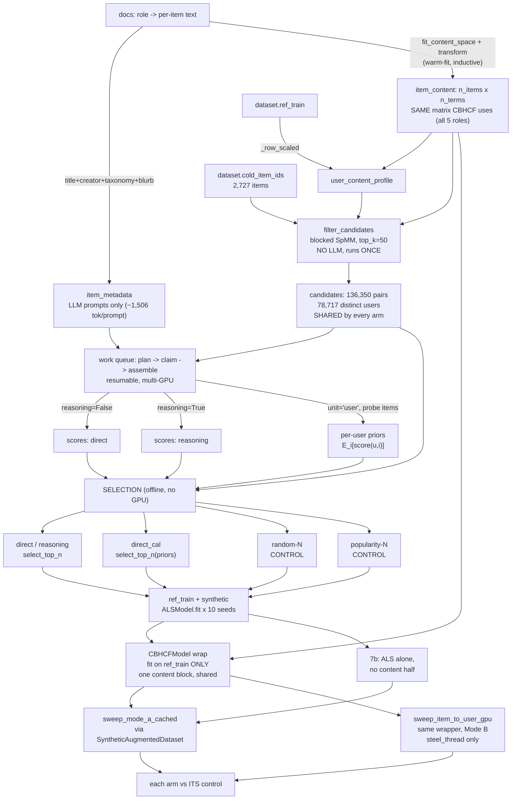

# How does Intervention B generate synthetic interactions for cold items?

A two-stage funnel, following ColdLLM ([arXiv:2402.09176](https://arxiv.org/abs/2402.09176)):
**Filtering Simulation** narrows every cold item's candidate pool from all 384,339 users down to
the top-K most content-similar, then **Refining Simulation** asks an LLM about each surviving
(item, user) pair. The survivors become a synthetic interactions matrix, added to `ref_train`
before fitting ALS — giving a cold item something to learn from *before* it has accumulated a
single real interaction, which is exactly the case [05-what-metrics-mean.md](05-what-metrics-mean.md)
and `steel_thread.ipynb`'s fold-in sweep show ALS's `recalculate_item` cannot help with at all
(its closed-form solve returns the exact zero vector at `k=0`).

**The headline result is a null, and the controls are what make it trustworthy.** See
[What the run found](#what-the-run-found). Read that section before extending this — several of
the design decisions below only make sense once you know what they were defending against.

## Scores, then selection — the decision this module is built around

The paper's refiner is LoRA-fine-tuned, so its yes/no verdict carries a calibrated confidence.
Run **zero-shot**, the same question is answered "yes" for **97.1%** of the candidates Filtering
has already selected (88.3% for the reasoning prompt). A binary verdict is therefore nearly
constant: it throws away the ordering *within* those yes-es — the only informative part of the
output — and leaves a probability threshold with nothing to sort.

So Refining stores a **graded log-odds per pair**, and every decision about which pairs become
interactions happens afterwards, in memory:

| rule | source | question it answers |
|---|---|---|
| `select_top_n` | [coldllm.py:815](../recsys/coldllm.py:815) | the intervention: the n best-ranked users per item |
| `select_top_n(priors=...)` | [coldllm.py:815](../recsys/coldllm.py:815) | is it ranking users, or their agreeableness? |
| `random_n_matrix` | [coldllm.py:889](../recsys/coldllm.py:889) | **control: is there any signal at all?** |
| `popularity_n_matrix` | [coldllm.py:923](../recsys/coldllm.py:923) | control: is it just a popularity proxy? |
| `select_top_n_floored` | [coldllm.py:856](../recsys/coldllm.py:856) | abstention variant (not used — see below) |

Two consequences worth stating plainly, because they shape everything downstream:

**Ranking, not thresholding.** The ordering is the trustworthy part of an uncalibrated judge: any
monotone recalibration — a different prompt, a more agreeable model — leaves a top-N selection
unchanged while moving a probability cutoff arbitrarily.

**Selection is offline, so N and every ablation are free.** Generating the scores is ~5 GPU-hours;
turning them into a matrix is milliseconds. `_write_result`
([coldllm.py:527](../recsys/coldllm.py:527)) therefore persists **every scored pair with its
score**, not just the survivors. The N-sensitivity sweep, the calibrated arm and both controls
were all produced from one generation pass.



## Node reference

| Node | Source | Purpose |
|---|---|---|
| `user_content_profile` | [coldllm.py:375](../recsys/coldllm.py:375) | `_row_scaled(train_matrix) @ item_content` — the exact computation CBHCF's own frozen user profile uses. |
| `filter_candidates` | [coldllm.py:381](../recsys/coldllm.py:381) | Cosine similarity via sparse inner product, **blocked over items**. One product per item cost a full pass over `user_profiles`' 463M nonzeros — O(n_cold · nnz) ≈ 1.3e12 ops, ~3 hours. Blocking amortises each pass across 128 items: 8m38s, and the candidate sets it produces are bit-identical to the per-item loop's, order included, at any block size. |
| `VLLMColdLLMSimulator` | [coldllm.py:283](../recsys/coldllm.py:283) | One vLLM generation engine per pass. Absorbs three environment differences so the module runs across vLLM versions — see [Environment](#environment-shims). |
| `yes_logodds` | [coldllm.py:306](../recsys/coldllm.py:306) | The graded score: `log P(yes) − log P(no)` at the answer position. |
| `_logodds_at` | [coldllm.py:89](../recsys/coldllm.py:89) | Extracts it. Sums mass over verbalizer surface forms, and **bounds** rather than discards a missing side — see [Reading the score](#reading-the-score). |
| `_answer_position` | [coldllm.py:129](../recsys/coldllm.py:129) | Position 0 for direct; the last yes/no position for reasoning, whose score is conditioned on its own generated text. |
| `run_key` / `plan_work` / `claim_chunk` | [coldllm.py:486](../recsys/coldllm.py:486) | The work queue — see [Surviving a long run](#surviving-a-long-run). |
| `_write_result` | [coldllm.py:527](../recsys/coldllm.py:527) | Atomic publish of **every scored pair with its score**. |
| `assemble_user_priors` | [coldllm.py:774](../recsys/coldllm.py:774) | Per-user baseline plus the variance components that decide whether subtracting it helps. |
| `probe_items` | [coldllm.py:945](../recsys/coldllm.py:945) | A fixed sample of **real** items, shared by every user — a paired design. |
| `SyntheticAugmentedDataset` | [coldllm.py:963](../recsys/coldllm.py:963) | Wraps `dataset` so `fold_in()` sees synthetic interactions at every `k`, including `k=0`. Carries a fingerprint salt so `ALSModel.fold_in`'s memo cannot collide across arms ([load.py:140](../recsys/load.py:140)). |
| `revealed_item_users_at_k` override | [coldllm.py:1015](../recsys/coldllm.py:1015) | The **only** method overridden — see [Keeping synthetic data out of the exclusion set](#keeping-synthetic-data-out-of-the-exclusion-set). |
| `wrap_seeds` / `build_content_cache` | [cbhcf.py:452](../recsys/cbhcf.py:452), [cbhcf.py:169](../recsys/cbhcf.py:169) | The content half depends on neither seed nor arm, so one block is built and every model borrows it by reference. |
| `sweep_mode_a_cached` | [eval.py:261](../recsys/eval.py:261) | The same warm-up sweep `steel_thread.ipynb` uses, run against `SyntheticAugmentedDataset`. |
| `sweep_item_to_user_gpu` | [eval.py:525](../recsys/eval.py:525) | The Mode B dual, added to `steel_thread.ipynb` Section 10 — see [Mode B](#mode-b) below. This notebook stays Mode A only: it exists to *generate and select* the synthetic interactions, and the steel thread is where every arm is reported on a common basis. |

## Mode B

`steel_thread.ipynb` Section 10 sweeps every arm in Mode B as well, through the same wrapper with
nothing added to this module. `sweep_item_to_user_gpu` reaches the dataset only through methods
`SyntheticAugmentedDataset` either overrides (`revealed_item_users_at_k`) or delegates, and CBHCF's
`mode_b_source()` reads the folded cold-item factors — which is exactly where the synthetic
interactions enter. Swept per seed, like Mode A, because the random control draws per seed.

Two properties are worth stating rather than leaving to be rediscovered:

- **The exclusion set is the real revealed history, not the augmented one.** This sweep builds its
  per-item "already seen" mask from `revealed_matrix_at_k`, which the wrapper deliberately does not
  override, so a synthetic user stays eligible to be returned in the top-K. That is the correct
  behaviour and the same reasoning as Mode A: the pair was selected from content similarity and an
  LLM verdict with no sight of `test_matrix`, so a synthetic user who is also a test positive is a
  prediction, not leakage. Excluding them would delete candidates from the axis being ranked.
- **Every arm shares CBHCF's Mode B ceiling, by construction.** `ceiling_item_users` is not
  overridden, so `mode_b_reference` folds each cold item in from its real pre-test history whatever
  the arm. The steel thread borrows `cbhcf_b_ref` rather than spending ten fold-ins to recompute an
  identical number, and records the reason alongside it — the same treatment 9c gives the equity
  ceiling.

Mode B may be the more sensitive of the two views here. At `k=0` an unaugmented cold item's factor
is the exact zero vector, so every user scores identically and the collaborative ranking is
degenerate ties; synthetic interactions are the only thing that can produce a user ordering at that
point. Everything in [What the run found](#what-the-run-found) is Mode A, measured by this
notebook; the Mode B curves are reported by the steel thread.

## Reading the score

`yes_logodds` returns **log-odds**, not P(yes), for two measured reasons.

**Resolution.** The direct strategy's scores run p10 +6.8 → p90 +15.1, i.e. P(yes) from 0.9989 to
0.99999973. As float probabilities those are indistinguishable from 1.0; there would be nothing
to rank. Log space keeps them six units apart.

**Invariance.** A difference of logprobs is unaffected by whatever constant the distribution was
normalised by, so the score does not depend on structured decoding's masking internals.

**The missing side is bounded, not dropped.** vLLM reports the top-k of the **unmasked**
vocabulary even under structured decoding — the returned candidates include tokens the grammar
forbids (`_no`, `.no`), which is the proof. So when the model is emphatic the losing answer falls
outside the window entirely (measured: 1.7% of reasoning completions at k=20). Those are the
*most confidently negative* pairs; discarding them would bias selection toward the pairs the model
was unsure about. Anything outside the window is by construction no more probable than the
smallest logprob in it, so that value is a valid ceiling. `n_logprobs` is 64 for the same reason.

## Calibration: which corrections can possibly matter

Selection is a **within-item** ranking, so a correction only matters if it varies across *that
item's* candidates. That gives a clean taxonomy, and the first row is an identity rather than an
observation — a constant subtracted from every candidate cannot change their order:

| correction | varies within an item's candidates? | effect on top-N |
|---|---|---|
| global (one content-free probe) | no — one constant | **provably none** |
| per-item | no — constant within the item | none |
| **per-user** | **yes** | **reorders** |

So the calibration pass scores **users**, not a placeholder. Each user is measured against a
shared sample of real items and their mean subtracted:

```
score_cal(u, i) = logodds(u, i) − mean_j logodds(u, probe_j)
```

Structurally this is **PMI** — cancel a marginal to recover an association — in logit space rather
than log space, because these probabilities saturate near 1. It converts "which users are
agreeable" into "which users are agreeable *about this item*".

Two design points that are easy to get wrong:

- **Probe with real items, not a null token.** A content-free item is out of distribution, so
  probing with it measures the model's reaction to a degenerate prompt rather than the user's
  baseline. Averaging over several real items is an honest Monte Carlo estimate of `E_i[score]`.
- **The prior is a sample mean, so it carries error `σ/√n`** — and that error is subtracted from
  every score. Too few probes and the correction injects more noise than the bias it removes. The
  break-even is `n > var_within / var_between`; `assemble_user_priors` reports both components.
  Measured here: within 17.9, between 11.6, so the requirement is **n > 1.5** and `N_PROBE = 8`
  clears it comfortably.

### Why the calibrated arm is not used as evidence

The break-even test above asks whether the prior is estimated *precisely* enough. It does not ask
whether the prior is the *right quantity* — and on that, the run is unambiguous. §5f also reports:

| statistic | value |
|---|---|
| var(score) over pairs | 16.281 |
| var(user baseline) over pairs | 12.766 |
| **corr(score, baseline)** | **+0.172** |

If `score(u, i)` decomposed as `baseline(u) + association(u, i)`, then `cov(score, baseline) =
var(baseline)` and the correlation would have to be `sqrt(12.766 / 16.281) = 0.885`. It is **0.172**.
The probe baseline is close to orthogonal to the scores it is subtracted from, so subtracting it is
not cancelling a marginal — it is adding a user-level quantity of comparable variance that barely
tracks what it is meant to correct. That is why it reshuffles 72% of selections (Jaccard 0.161).

The likely cause is a regime mismatch. Probes are 8 random warm items and score **mean +1.94**;
candidate pairs are content-filtered to the 50 nearest users and score **median +13.43**. The
baseline is measured where the judge is undecided and applied where it is saturated, and logit
differences do not carry across those two regimes. Probing with real items rather than a null token
was the right instinct — but the expectation that needed estimating was over the *item's candidate
pool*, not over the catalogue.

One consequence is systematic rather than noisy: a user with a long history is agreeable about the
probes too, so the correction penalises exactly the high-degree users. That is how the calibrated
arm ends up selecting users *less* active than a random draw.

> **`direct_cal` is a negative result about this calibration, not a measurement of the LLM.** It
> shows the probe-based correction is not usable as specified. It cannot, on its own, say what the
> raw LLM score was tracking, and "What the run found" does not use it that way.

## Surviving a long run

Refining is ~136,000 LLM calls per strategy plus ~630,000 for the calibration pass, across a box
whose second GPU is not always free. Chunks are **claimed** via an atomic `O_CREAT | O_EXCL` file
create — the filesystem is the lock, there is no coordinator to run or crash. Claims carry a
heartbeat (the file's mtime, refreshed *from inside* the batch loop), so a killed worker's chunk is
reclaimed rather than stranded, while a healthy long chunk is not stolen mid-flight.

This buys three properties at once: **resumable** (chunk-granular), **elastic** (a second notebook
can join or leave at any moment), and **no broker**. All three were verified under load — four
concurrent processes claiming from one directory never double-claimed, a stale claim with no
result was reclaimed while a stale claim *with* a result was left alone, and re-planning returned
the existing manifest rather than renumbering chunks out from under a running worker.

> The work directory must sit on a real POSIX filesystem. `O_CREAT | O_EXCL` atomicity and
> trustworthy mtimes hold on ext4; neither is guaranteed on a mounted Windows or Drive path.

`run_key` covers everything that changes the **scores** — fingerprint, model, top_k, strategy,
prompt construction — and deliberately *not* the selection rule, which consumes them offline.

## Prompt roles are a cost decision, and a large one

Measured with the real tokenizer over all 136,350 pairs, not a sample:

| roles in the prompt | tokens/prompt |
|---|---|
| `title + creator + taxonomy + blurb` | **1,506** mean, 9,889 max |
| + `reviews` (Amazon's `description`, 847 words alone) | **9,434** mean |

A 6.3× difference landing almost entirely on the ten history items — the difference between a long
day and a long week of GPU time. `reviews` is excluded from the *prompt*; `item_content` still uses
all five roles at the tuned weights, so Filtering and CBHCF are unaffected.

Prompts are built **user-major** within a chunk. The history block is ~10/11 of a prompt's tokens
and depends only on the user, so consecutive prompts for one user share a long identical prefix
that vLLM's prefix cache serves instead of re-prefilling. Measured: the calibration pass, where
each user's 8 probes differ only in the trailing item, ran at **31.7 prompts/s** against the pair
pass's **14.9**.

## Keeping synthetic data out of the exclusion set

The synthetic matrix is data, not a scorer. It belongs in whatever matrix a model is fit or folded
on — the slot `Dataset.revealed_matrix_at_k(k)` already occupies — and must **never** reach the
matrix `eval.py` treats as "already interacted" for `recommend()` / `ndcg_at_k` /
`recall_and_hit_rate_at_k` / `auc_at_full`. Unlike real revealed history, guaranteed disjoint from
`dataset.test_matrix` by `load.py`'s reveal/reserve split, a synthetic interaction has no such
guarantee — masking with it would risk silently excluding the exact test items being measured.

This is why `SyntheticAugmentedDataset` overrides **only** `revealed_item_users_at_k`
([coldllm.py:1015](../recsys/coldllm.py:1015)) and leaves `revealed_matrix_at_k` untouched.
The class deliberately does not define it, and that absence is checked rather than assumed —
overriding it is the kind of change that looks harmless and silently corrupts every metric.

## What the run found

Full population: 2,727 cold items, top_k=50, **N=7** (the median warm item's degree in `ref_train`,
fixed a priori — no cold-item outcome consulted), 10 seeds. **Every arm injects exactly 19,089
interactions**, so no difference between them can be explained by volume.

**Inside CBHCF (§8), NDCG@100 at k=0** — baseline 0.0419, seed sd ≈ 0.0001:

| arm | NDCG | vs random (5 d.p.) |
|---|---|---|
| direct | 0.0421 | +0.00002 |
| direct_cal | 0.0420 | −0.00003 |
| reasoning | 0.0421 | +0.00005 |
| random-N | 0.0420 | — |
| popularity-N | 0.0422 | +0.00017 |

> Reported to five decimals deliberately. At four these all read `+0.0000`, which invites the
> conclusion that nothing happened — and the paired test below shows every one of them is
> significantly non-zero. The gaps are genuinely tiny; they are not zero.

**With the content half removed (§7b)** — the maximum-sensitivity view, where unaugmented ALS
scores exactly 0.000000 because the closed-form fold-in returns the zero vector:

| arm | ALS-only NDCG at k=0 |
|---|---|
| no synthetic data | 0.000000 |
| **random-N** | **0.000000 ± 0.000000** |
| direct | 0.000026 ± 0.000004 |
| reasoning | 0.000027 ± 0.000000 |
| **direct_cal** | **0.000000 ± 0.000000** |
| **popularity-N** | **0.000037 ± 0.000016** |

> Note that random-N is *also* exactly 0.000000 here, so this view floors out: it cannot distinguish
> "level with random" from "below random". The paired test below, which can, puts `direct_cal`
> below.

**With the synthetic data kept out of the ALS fit (§7c)** — the controlled form. ALS alternates
over the whole matrix, so synthetic pairs in `fit()` perturb the **user** factors too, and this
project's controlling principle is that user preferences are fit once, frozen, and reused
identically everywhere. §7 quietly broke that. Here the collaborative models are the steel thread's
own cached seeds, fit on `ref_train` alone and bit-identical to those behind `cbhcf_curve`, so the
only thing that varies is what `recalculate_item` receives at each `k`:

| arm | fold-in only | §7 (in the fit) | vs random |
|---|---|---|---|
| popularity-N | 0.04222 | 0.04222 | **+0.00017** |
| reasoning | 0.04209 | 0.04209 | +0.00004 |
| direct | 0.04206 | 0.04206 | +0.00002 |
| random-N | 0.04204 | 0.04204 | — |
| direct_cal | 0.04202 | 0.04201 | −0.00003 |

Two results, one of them independently interesting:

- **The design flaw was real but inconsequential** — 19,089 pairs against `ref_train`'s 2.67M is
  0.7% of the matrix, and the user factors barely moved. The controlled and uncontrolled forms
  agree to five decimals. The notebook now uses the controlled form regardless, so "only the
  item's representation differs" is true rather than approximately true.
- **The retraining step contributes nothing.** ColdLLM adds synthetic interactions to training and
  refits; folding them in at evaluation reproduces the entire effect. The expensive half of the
  method buys zero here — and fold-in is also the deployable half, since retraining on every cold
  arrival is not practical.

### The paired test, and what it changes

Because the arms share seeds *and* now share user factors, the comparison against a control is
**paired**: most of each arm's ~1e-4 spread is common-mode ALS initialisation that cancels in the
per-seed difference. Judging a 2e-5 gap against the individual bands would have called everything
noise — wrongly. Over 10 seeds (9 d.f., two-sided 5% point 2.26):

| arm | mean diff vs random | sd | t | mean degree of selected users |
|---|---|---|---|---|
| popularity-N | +0.000173 | 0.000039 | **+13.98** | 5.88 |
| **reasoning** | **+0.000045** | 0.000019 | **+7.69** | **3.07** |
| direct | +0.000021 | 0.000021 | +3.20 | 3.39 |
| random-N | — | — | — | 2.30 |
| **direct_cal** | **−0.000028** | 0.000014 | **−6.44** | **2.03** |

> ⚠️ **The mean-degree column has no cell behind it.** Every other number in this section traces to
> a printed output in `intervention_b_coldllm.ipynb`; this one was computed ad hoc and no revision
> of the notebook reproduces it. The argument below leans on it, so treat it as provisional until
> the notebook prints it.

**Every arm differs significantly from random.** The LLM's ordering is not noise — it is a small,
reproducible, statistically robust improvement. Two consequences the aggregate null obscures:

- **B2 beats B1 by roughly 2× (t = 7.69 vs 3.20).** Comparing the two prompting strategies was a
  stated goal of this intervention, and it has a clear answer: asking for a one-sentence reason
  before the verdict produces a materially better ordering.
- **The calibrated arm lands below random**, but it is excluded from the interpretation that
  follows — see [Why the calibrated arm is not used as evidence](#why-the-calibrated-arm-is-not-used-as-evidence).

The selected-user activity column is suggestive. Mean training degree orders popularity (5.88) >
LLM (3.1–3.4) > random (2.30), which tracks the t-values at the top: picking active users helps.

**But `reasoning` selects LESS active users than `direct` (3.07 vs 3.39) while scoring twice as
well.** Activity cannot explain that ordering, so B2's advantage over B1 is not a popularity
effect — it is the one place in this run where the LLM demonstrably contributes something beyond
user activity.

None of which changes the practical conclusion: the largest effect here, popularity's, is
**+0.4%** of the baseline, and the best LLM arm's is **+0.1%**. Significance and relevance are
separate questions, and this run answers them differently.

Three observations, and one reading that fits two of them:

1. The LLM's ordering **does** beat random — 0.000026 against exactly 0, roughly 6σ. Real.
2. **Picking active users beats it.** popularity-N is highest, by 4× the best LLM arm.
3. Raw `direct` overlaps popularity-N at **Jaccard 0.202** against a **0.075** chance floor. In
   selection terms that is 2.35 of 7 picks shared where chance gives 0.98 — a real tilt toward
   popular users, and not much more: 4.65 of 7 are picks popularity would not have made.

The tempting reading is that the LLM was doing popularity estimation in disguise — agreeable users
are active users, and active users are better anchors for a cold item's factor. Observations 2 and
3 fit it. **`reasoning` does not:** as above, it scores twice what `direct` does on *less* active
users, and it overlaps popularity-N less as well (Jaccard 0.157 vs 0.202). If activity were the
mechanism, the ordering would run the other way.

What this run supports is narrower: **most of `direct`'s small advantage is consistent with its tilt
toward active users, and popularity-N gets more of that same effect more cheaply.** Whether that is
the whole story is not settled here. Settling it needs a degree-matched LLM arm — select 7 of an
item's 50 candidates by LLM score while matching popularity-N's degree distribution — which is an
offline operation over the stored pair scores and costs no GPU time.

And the magnitude settles the practical question: **0.000026 against a CBHCF baseline of 0.0419 is
0.06%.** Statistically unambiguous, practically irrelevant — which is why §8's differences vanish
at four decimal places. That is not the hybrid hiding the effect; the effect is genuinely that
small, in the hybrid and outside it alike.

> **The defensible claim.** ColdLLM-style synthetic interactions, generated **zero-shot**, improve
> cold-start retrieval over a random draw from the same content-filtered pool by a statistically
> robust but practically negligible margin (+0.1%), and are outperformed by simply choosing the
> most active candidate users (+0.4%). Most of the LLM's advantage is consistent with user activity;
> the exception is the reason-then-answer prompt, which beats the direct prompt while selecting
> *less* active users, and so contributes something activity alone cannot account for.

Stated that way rather than as a flat null, because the paired test is unambiguous: the effects are
real. What they are not is *useful* — every arm sits within 0.4% of a baseline that a content
hybrid already provides for free.

**The limitation that belongs beside it.** The paper fine-tunes its refiner with LoRA, which is
what makes its yes/no a calibrated confidence. This is evidence about a *zero-shot* instantiation
— measured at 97.1% acceptance — not about ColdLLM as published.

### The positive finding inside the null, and why it is confounded

Filtering selects candidates by content similarity with **no reference to the train/test split**,
so a synthetic pair can be a held-out test pair. Measured against the 13,635 reserved cold-item
test interactions:

| arm | injected | are test pairs | rate | vs base |
|---|---|---|---|---|
| candidate pool (ceiling) | 136,350 | 625 | 0.458% | — |
| random-N | 19,089 | 92 | 0.482% | 1.0× |
| reasoning | 19,089 | 162 | 0.849% | **1.8×** |
| direct | 19,089 | 188 | 0.985% | **2.0×** |
| popularity-N | 19,089 | 243 | 1.273% | **2.6×** |

Random lands on the pool's base rate, as it must. **The LLM picks real held-out interactors at
twice that rate** — a genuine, measurable ability, and precisely what ColdLLM claims. It is the
positive result hiding inside the null.

It is also *confounded with leakage*: those pairs are test labels being trained on, so the item's
factor is built partly from a user it is then scored against. The two readings cannot be separated
by this measurement — an accurate refiner and a leaking one look identical. Three things bound the
damage: the overlap is 1% of injected pairs and 1.4% of the test set; every arm is exposed, so the
arm-vs-control comparison stays fair; and §7c confines the effect to the item factor rather than
also perturbing user factors. Leakage inflates the LLM arms, and they *still* do not beat random
in the hybrid — so the null holds a fortiori.

Note that popularity-N enriches more (2.6×) than either LLM arm, which is the same
popularity-proxy story arriving by a third route.

> **If this is taken further**, the honest fix is to define the candidate pool without reference to
> the split, then report enrichment as its own metric rather than letting it reach the training
> matrix — "does the refiner identify real interactors?" is a cleaner and more answerable question
> than "does the recommender improve?", and this run answers the first one affirmatively while
> answering the second one negatively.

Supporting numbers, all from the same run:

- **N-sensitivity** (a robustness check, never a selection): NDCG 0.0419 → 0.0420 → 0.0428 as N
  goes 1 → 7 → 50, *identically* for the LLM and random. Volume helps slightly; selection does not.
  At `N = top_k` all arms keep the whole pool and the gap is exactly zero — a built-in correctness
  check that passed.
- **Abstention was measured and found moot**: 0 items had fewer than N positively-scored
  candidates, so `select_top_n_floored` was not needed. The threshold for adding it (>5% of items)
  was fixed before the numbers were seen.
- **Quantization**: AWQ vs bf16 over 1,000 identical pairs — within-item Spearman
  +0.78, top-7 Jaccard 0.50 against a 0.16 chance floor. The ordering survives, but ~1 in 3
  selected users differs, so the specific interactions are quantization-dependent.

## Extensions deliberately not run

Both are selection rules over stored scores — no GPU — and were left out on design grounds:

- **Uncapped abstention.** The floor arm is `min(N, endorsed)`. Taking *every* endorsed pair is the
  literal reading of the paper, but at ~98% acceptance most items would receive 40–50 interactions,
  putting every cold item in the top 2% of the real degree distribution. That tests "does more
  synthetic data help?", which the `N=50` point already speaks to.
- **Confidence weighting.** ALS reads its input as confidence (`c_ui = 1 + α·r_ui`), so pairs could
  carry a weight from their score rather than being binarised. The objection is not mechanical — a
  control matched on total weight is constructible — it is that weighting consumes the
  **magnitudes**, and this design rests on the magnitudes being untrustworthy while the ordering is
  not. Weighting by **rank** is the monotone-safe version and the better form of this extension.

## Environment shims

`recsys/coldllm.py` absorbs several platform differences rather than pinning the project to one
release. Each exists because it was hit:

| shim | source | what it fixes |
|---|---|---|
| `_structured_outputs` | [coldllm.py:152](../recsys/coldllm.py:152) | `GuidedDecodingParams` (≤ ~0.9) vs `StructuredOutputsParams` (0.26). |
| `_engine_role` | [coldllm.py:264](../recsys/coldllm.py:264) | `LLM(task=...)` vs `LLM(runner=...)`; the old name is a hard `TypeError`. |
| `_enable_wsl_pin_memory` | [coldllm.py:173](../recsys/coldllm.py:173) | vLLM disables pinned memory on any WSL detection. In 0.26 that is **fatal**, not slow: `is_uva_available()` *is* `is_pin_memory_available()`, so the engine dies with `RuntimeError: UVA is not available`. |
| `_prepare_build_toolchain` | [coldllm.py:207](../recsys/coldllm.py:207) | Puts the env's own `bin/` (for `ninja`) and its bundled **cu13** toolchain ahead of a distro CUDA 12 `nvcc` on `PATH`, sets `CUDA_HOME` and `LD_LIBRARY_PATH`. A mismatched compiler fails deep inside a ninja log rather than saying so. |

Two environment facts that are not shims and must hold:

- **`nvidia-cuda-nvcc` must match `torch.version.cuda`.** They drifted here (nvcc 13.3 against
  CUDA 13.0 headers) and flashinfer's bundled CCCL rejects it outright.
- **`torchcodec` must not be installed.** Its loader raises `RuntimeError`, which
  `sentence_transformers` guards with `except (ImportError, OSError)` — so it silently breaks
  Intervention A. See [requirements.txt](../requirements.txt).

## What was verified

Each of these was checked against the running code rather than reasoned about, because each is a
property that fails **silently** — the run completes, the numbers look plausible, and the defect
only shows up as a wrong conclusion.

| area | what was checked |
|---|---|
| **Work queue** | Four concurrent processes claiming from one directory never double-claim. A stale claim with no result is reclaimed; a stale claim *with* a result is left alone (redoing it is pure duplicated spend). Re-planning returns the existing manifest rather than renumbering. Assembly refuses a partial run instead of silently returning a short matrix. |
| **Fold-in isolation** | An augmented dataset fingerprints differently from the plain one (so `fold_in`'s memo cannot collide across arms) while a plain `Dataset` keeps the exact 10-tuple every cache key and artifact already stores. `revealed_matrix_at_k` is never overridden. |
| **Scoring** | Log-odds is invariant to a constant shift of every logprob. Probability mass is summed across verbalizer surface forms rather than read off one. A missing side is bounded at the window's floor and flagged, not discarded — and the symmetric confident-*yes* case behaves the same way. |
| **Selection** | Top-N keeps exactly N per item, deterministically, excluding unscorable pairs. **A global prior provably cannot reorder a per-item ranking; a per-user one does** — the reason the calibration pass scores users. |
| **Controls** | Every arm injects the same count, so a curve gap cannot be volume. `random-N` draws only from Filtering's own candidates, reproduces under a fixed seed, and *differs* across seeds so its band carries draw variance. The variable-N floored arm has a control matched to its per-item counts. |
| **Filtering rewrite** | The blocked implementation returns bit-identical candidate sets to the per-item loop, order included, at every block size. |
| **End to end** | A live engine over a handful of real cold items: engine build, prompt construction, structured decoding, scoring, atomic write, assembly, selection, both controls, and the fold-in wrapper. |
| **Quantization** | AWQ against bf16 on identical pairs: within-item rank correlation and top-N agreement, judged against the chance floor for two independent picks rather than against zero. |
